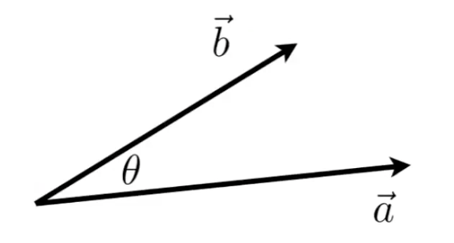
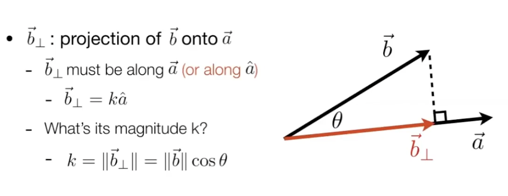
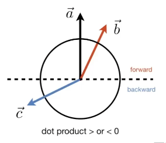
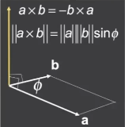
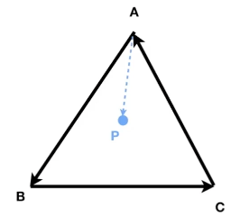

# 线性代数

### 向量(Vector)

从A点指向B点的

#### 点乘/点积（dot product）

$$
\overrightarrow{a}\cdot \overrightarrow{b} = \|\overrightarrow{a}\|\|\overrightarrow{b}\|cos(\theta)
$$

向量点乘的结果是一个数字

**点乘的几何意义是可以用来表征或计算两个向量之间的夹角，以及在b向量在a向量方向上的投影**

**点乘满足交换律、结合律、分配律**

2D情况下：
$$
\overrightarrow{a}\cdot \overrightarrow{b} = 
\begin{pmatrix}x_a\\y_a\end{pmatrix} \cdot 
\begin{pmatrix}x_b\\y_b\end{pmatrix}  =
x_ax_b+y_ay_b
$$
3D情况下：
$$
\overrightarrow{a}\cdot \overrightarrow{b} = 
\begin{pmatrix}x_a\\y_a\\z_a\end{pmatrix} \cdot 
\begin{pmatrix}x_b\\y_b\\z_b\end{pmatrix}  =
x_ax_b+y_ay_b+z_az_b
$$
点乘的主要作用，就是找到两个向量之间的夹角， 这样就可以计算：

1. 计算光线的入射角
2. 物体表面法线
3.  一个向量“投影”到另一个向量上是什么样子:

4. 点乘还可以用来计算两个向量是否“方向接近”， 如果两个向量比较接近，那么点乘后的值应当接近1

5. 用于检测前向/后向， 点乘大于0 是正向，小于0是负向，等于0是垂直方向。  如下图， 红色向量相对黑色向量就是正向， 蓝色向量相对黑色向量就是负向。

   

#### 叉乘/叉积（cross product）

向量叉乘后，是一个新的垂直于a和b的向量。 新的向量的方向遵循右手定则确定

  
$$
\overrightarrow{x} \times \overrightarrow{y} = +\overrightarrow{z}\\
\overrightarrow{a} \times \overrightarrow{b} = \overrightarrow{0} \\
\overrightarrow{a} \times (\overrightarrow{b} + \overrightarrow{c}) =  \overrightarrow{a} \times \overrightarrow{b} + \overrightarrow{a} \times \overrightarrow{c}\\
\overrightarrow{a} \times (k\overrightarrow{b}) = k \overrightarrow{a} \times \overrightarrow{b} \\
$$
向量叉乘**不满足交换律**， 但是**满足分配律、结合律**

代数形式：
$$
\overrightarrow{a} \times \overrightarrow{b} = \begin{pmatrix}y_az_b-y_bz_a\\z_ax_b-x_az_b\\x_ay_b-y_ax_b\end{pmatrix}
$$

矩阵形式：
$$
\overrightarrow{a} \times \overrightarrow{b} =  (A^*)b = 
\begin{pmatrix}
0&-z_a&y_a\\
z_a&0&-x_a\\
-y_a&x_a&0\\
\end{pmatrix}
\begin{pmatrix}
x_b\\
y_b\\
z_b\\
\end{pmatrix}
$$

用途：

1. **判定左/右**：a叉乘b后为正向量，说明 b一定在 a左侧；  如果为负向量，则b一定在a右侧

2. **判定内/外**：利用叉乘判定一个点是否在形状内/外，如下图，可用  AB AP 做叉乘， BC BP叉乘， CA CP 叉乘是否都为正（都在三条边的左侧），就可以判定 P是否在三角形内部。    这样可以用于计算三角形覆盖那些像素，用于光栅化计算，对像素着色

   

#### 直角坐标系

通常我们会定义三个模为1的向量 u,v,w 的单位向量，这样我们可以把任意一个向量分解为这三个方向向量的投影之和。

当 u、v、w 向量相互垂直的时候，我们就能很方便的用三个数字表示任意一个点。 这就是直角坐标系。

### 矩阵(Matrix)

矩阵就是由m行n列构成的一个数列

#### 矩阵乘积（multiplication）

第一个矩阵的列数必须等于第二个矩阵的行数的时候，才能进行两个矩阵相乘。
$$
\underbrace{(M \times \textcolor{red}{N})}_A
\underbrace{(\textcolor{red}{N} \times P)}_B = 
\underbrace{(M \times P)}_C
$$
（也即：M行N列矩阵A 乘与 N行P列矩阵B 等于 M行P列矩阵C）

矩阵乘法简单的记忆方法：

**计算结果矩阵 C 的第 m行第p 列位置的值，等于原来矩阵 A的第m 行矩阵点乘矩阵B第n列矩阵**, 例如：
$$
\begin{pmatrix}
a_{11}&a_{12}\\
a_{21}&a_{22}\\
a_{31}&a_{32}\\
\end{pmatrix}

\begin{pmatrix}
b_{11}&b_{12}&b_{13}&b_{14}\\
b_{21}&b_{22}&b_{23}&b_{24}\\
\end{pmatrix}
=
\begin{pmatrix}
a_{11}b_{11}+a_{12}b_{21} & a_{11}b_{12}+a_{12}b_{22} & a_{11}b_{13}+a_{12}b_{23} & a_{11}b_{14}+a_{12}b_{24}\\
a_{21}b_{11}+a_{22}b_{21} & a_{21}b_{12}+a_{22}b_{22} & a_{21}b_{13}+a_{22}b_{23} & a_{21}b_{14}+a_{22}b_{24}\\
a_{31}b_{11}+a_{32}b_{21} & a_{31}b_{12}+a_{32}b_{22} & a_{31}b_{13}+a_{32}b_{23} & a_{31}b_{14}+a_{32}b_{24}\\
\end{pmatrix}
$$
矩阵乘积**不满足交换律**， 但是满足**结合律和分配律**

#### 矩阵乘以向量 

我们可以把向量看作列向量（w行1列）后，就可以用一个w列的矩阵乘以该向量。

例如：把任意一个点做y轴对称的操作，我们可以这么计算即可：
$$
\begin{pmatrix}
-1&0\\
0&1\\
\end{pmatrix}
\begin{pmatrix}
x\\
y\\
\end{pmatrix}
=
\begin{pmatrix}
-x\\
y\\
\end{pmatrix}
$$
这样我们可以用矩阵乘积，就能计算出镜像坐标。

#### 矩阵转置（Transpose）

把矩阵的行列交换，就叫矩阵转置通常记做上标T，例如：
$$
\begin{pmatrix}
1&2\\
3&4\\
5&6\\
\end{pmatrix}^T 
=
\begin{pmatrix}
1&3&5\\
2&4&6\\
\end{pmatrix}
$$
转置的特性：
$$
(AB)^T=B^TA^T
$$

#### 单位矩阵 (Identity Matrix) 及其逆(Inverses)

对角线为1，其余为0，且行列数相同的矩阵叫单位矩阵，如：
$$
I_{3\times3}=
\begin{pmatrix}
1&0&0\\
0&1&0\\
0&0&1\\
\end{pmatrix}
$$

矩阵的逆，是指我们如果能找到一个矩阵B， 使得矩阵A乘与该矩阵B后等于单位矩阵I，我们就称 B矩阵 是 A矩阵的 逆， 即：
$$
AA^{-1}=A^{-1}A=I
$$
逆运算也与转置比较类似，满足：
$$
(AB)^{-1}=B^{-1}A^{-1}
$$

#### 向量点乘/叉乘 的矩阵形式

向量的点乘/叉乘，我们可以用矩阵的乘积形式来表示：

- 点乘（Dot Product）

$$
\overrightarrow{a}\cdot\overrightarrow{b}= (\overrightarrow{a})^T\overrightarrow{b}\\
=
\begin{pmatrix}x_a&y_a&z_a\end{pmatrix}
\begin{pmatrix}x_b\\y_b\\z_b\end{pmatrix} = 
\begin{pmatrix}x_ax_b+y_ay_b+z_az_b\end{pmatrix}
$$

- 叉乘（Cross Product）

$$
\overrightarrow{a} \times \overrightarrow{b} =  (A^*)b = 
\begin{pmatrix}
0&-z_a&y_a\\
z_a&0&-x_a\\
-y_a&x_a&0\\
\end{pmatrix}
\begin{pmatrix}
x_b\\
y_b\\
z_b\\
\end{pmatrix}
$$

注意上面 A* 是一个叫“A*” ( dual matrix )的矩阵， 而不是 A乘b 的意思

