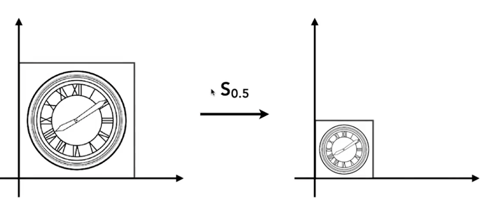
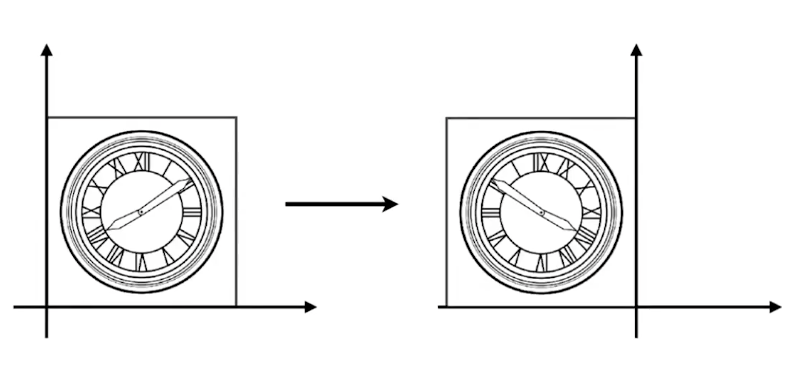
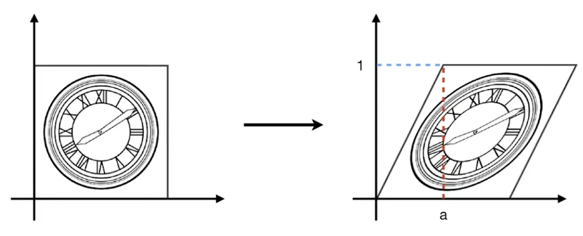
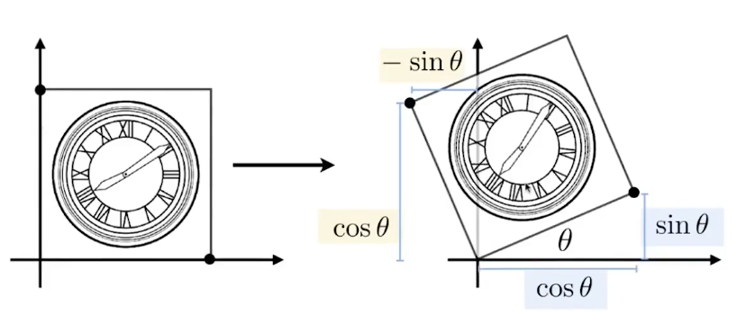
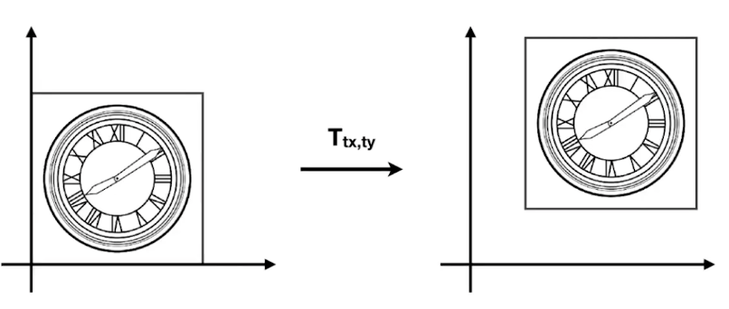
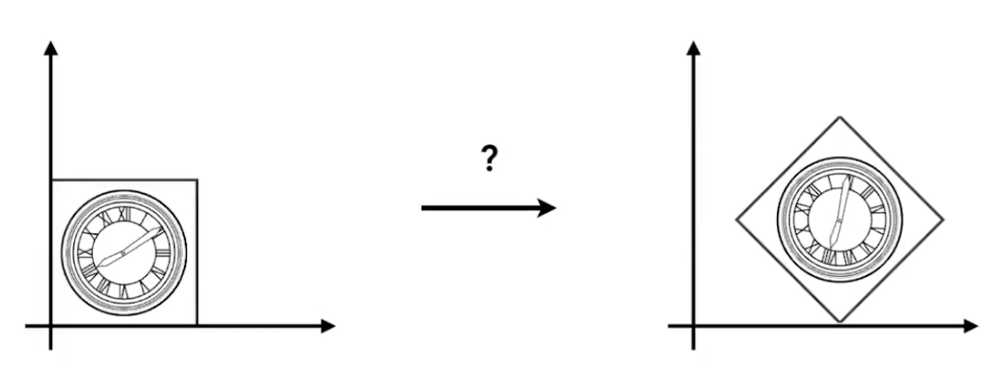

变换 (Transform)

变换是在处理3d场景中的重要数学工具。变换可以做到：

1. 在3d环境下移动、旋转、缩放3d物体
2. 构建显示表面环境的二维视图

**在世界坐标系中定义物体，一般使用右手坐标系， 所以下文的内容基于右手坐标系进行讨论及展示。**

一般而言，刚体只能被用于平移和旋转，缩放主要是用在物体建模时候。

#### 缩放矩阵（Scale Matrix）

我们定义一个矩阵S，S矩阵可以使得目标点按照原点缩小放大。 

此时对于坐标上的任意点，都有：
$$
\begin{bmatrix}x'\\y'\end{bmatrix} = \begin{bmatrix}s_x&0\\0&s_y\end{bmatrix}\begin{bmatrix}x\\y\end{bmatrix}\\
P'= SP
$$

#### 镜像矩阵（Reflection Matrix)

和缩放矩阵类似，我们也可以定义一个矩阵R，使得目标按照 x或y方向镜像

此时对于坐标上任意点，都有：
$$
\begin{bmatrix}x'\\y'\end{bmatrix} = \begin{bmatrix}-1&0\\0&1\end{bmatrix}\begin{bmatrix}x\\y\end{bmatrix}\\
P'= RP
$$

#### 切变矩阵（Shear Matrix）

切变矩阵可以让目标图片产生错切效果（y=0时水平挪动(shift)为0， y=1时水平挪动为a， 垂直方向 挪动shift 都是0）

此时对于坐标上任意点，都满足：
$$
\begin{bmatrix}x'\\y'\end{bmatrix} = \begin{bmatrix}1&a\\0&1\end{bmatrix}\begin{bmatrix}x\\y\end{bmatrix}\\
$$

#### 旋转矩阵（Rotate Matrix）

一般而言。如果没有特别声明，**旋转就是指绕着坐标系原点进行的**旋转

此时对于坐标上任意点，都满足：
$$
\begin{bmatrix}x'\\y'\end{bmatrix} = \begin{bmatrix}cos(\theta)&-sin(\theta)\\sin(\theta)&cos(\theta)\end{bmatrix}\begin{bmatrix}x\\y\end{bmatrix}\\
P'=RP
$$

#### 线性变换（Linear Transform = Matrices）

综上所述，我们就可以发现，上面的操作都可以用一个 2x2的矩阵对任意一个点进行乘积运算变换得到， 我们把这种变换就叫做线性变换。
$$
\begin{bmatrix}x'\\y'\end{bmatrix} = 
\begin{bmatrix}a&b\\c&d\end{bmatrix}
\begin{bmatrix}x\\y\end{bmatrix}\\
P'=MP
$$

特别的, 如果我们还能计算出一个结论，旋转角度为负值的矩阵，等于旋转角度为正的矩阵的逆，这个结论后面十分有用：
$$
R_{-\theta} = R^{-1}_\theta
$$

#### 平移（Translation）

但是特殊的，对于平移操作来说， 我们无法简单的吧点P‘ 的位置，用一个矩阵进行乘积后得到。

如上图，实际上要计算P‘ 我们需要用到矩阵的加法，而不是乘法。
$$
\begin{bmatrix}x'\\y'\end{bmatrix} = 
\begin{bmatrix}x\\y\end{bmatrix}
\textcolor{red}{+}
\begin{bmatrix}t_x\\t_y\end{bmatrix}\\
P'=T+P
$$

#### 齐次坐标系（Homogeneous Coordinates）

现在我们发现有个问题，就是我们虽然能用矩阵乘积和加法进行基本的变换， 但是由于平移变换的特殊性， 多引入了一个加法运算， 为了消除这个加法运算， 我们对点P增加一个缩放因子w，让顶点  P(x,y) 表示为    P(w*X,w*Y),  这样对于任何缩放因子 w≠0 时，二维笛卡儿坐标可以表示为
$$
P(\frac{X}{w},\frac{Y}{w})
$$
这个时候如果设 w=1 ，我们可以把一个点(x,y)的矩阵表示为

$$
P = \begin{pmatrix} x \\ y \\ 1 \end{pmatrix}
$$
那么此时，我们也可以用类似缩放矩阵或者旋转矩阵的方式来进行平移变换了， 这样形式上就统一了：

$$
\begin{pmatrix} x' \\ y' \\ 1 \end{pmatrix} = 
\begin{pmatrix} 1&0&t_x \\ 0&1&t_y \\ 0&0&1 \end{pmatrix}\begin{pmatrix} x \\ y \\ 1 \end{pmatrix}
=\begin{pmatrix} x+t_x \\ y+t_y \\ 1 \end{pmatrix}\\
P'=TP
$$

特别的，我们要注意下，当w=0的时候，我们表示的是一个向量，而不是一个点。也就是说，我们认为：

点 point(x,y)  应当表示为
$$
(x,y,1)^T
$$

向量 vector(x,y) 应当表示为

$$
(x,y,0)^T
$$

因为这里其实暗示，w更深层次的含义，是暗示了点和向量之间的加减， 因为点不具备方向，向量是具备方向且平移不变的：

- vector + vector = vector

- point - point = vector

- point + vector = point

- point +point =  两个点的中点

  

### 仿射（并行）变换（Affine）

接下来我们在上面讨论的基础上，在齐次坐标的变换公式中，继续加入缩放和旋转，组成一个完整的变换。（证明略，只给出最终形式）
$$
\begin{bmatrix} A_{11}&A_{12}&T_x \\ A_{21}&A_{22}&T_y \\ 0&0&1 \end{bmatrix}
$$
这样，我们就可以对任意的线性变换，给出单个变换矩阵的定义， 上面这样的变换矩阵，我们就称之为**仿射变换**。

也即一个仿射变换，由线性变换(旋转、缩放、斜切) 和 平移变换构成。
$$
S(s_x,s_y) = \begin{pmatrix}s_x&0&0\\0&s_y&0\\0&0&1\end{pmatrix}\\
R(\alpha) = \begin{pmatrix}cos\alpha&-sin\alpha&0\\sin\alpha&cos\alpha&0\\0&0&1\end{pmatrix}\\
T(t_x,t_y) = \begin{pmatrix}1&0&t_x\\0&1&t_y\\0&0&1\end{pmatrix}\\
$$
**仿射变换的代价，就是增加了空间复杂度**

#### 变换的合成(Composite Transform )/变换的叠加

现在我们来考虑一个问题，如何把左侧图片，变换到右侧？如和找到这样的一个变换?

此时，我们**可以用矩阵的乘法，即可完成变换的叠加操作**。 

比如，我们可以把物体先 旋转45度， 再平移，则：   P'=T(1,0)R(45)P

当然我们也可以向上平移后，再逆时针旋转45度：   P'=R(-45)T(0,1)P   。

注意这里的R(-45)矩阵不是上面的 R(45)矩阵， 因为矩阵乘法不满足交换律， 所以 AB ≠ BA

叠加的方式：如果三个矩阵乘法为 CBA , 则应用顺序为 A->B->C ,  也即，**右乘的都是先应用，左乘的都是后应用**
$$
A_n(...A_2(A_1(X))) = A_n...A_2A_1\begin{pmatrix}x\\y\\1\end{pmatrix}
$$

#### 变换的分解（Decomposing Complex Transform）

例如这个问题： 我们如何计算绕一个点C旋转的一个变换？

此时我们可以执行下面三个流程：

1. 把目标移动到原点
2. 旋转
3. 再移动回原来位置

于是可以有目标矩阵  
$$
T=T(c)R(\alpha)T(-c)
$$

例如，当我们只讨论 xoy 平面的，绕局部坐标系旋转的场景， 令 （Tx,Ty,0 ）为物品局部坐标系原点，那么应当应用的变换T应当为：
$$
T = T_2RT_1
\left.
= \begin{bmatrix} 1&0&0&-T_x \\ 0&1&0&-T_y \\ 0&0&1&0 \\ 0&0&0&1 \end{bmatrix}
\begin{bmatrix} cos(\theta)&-sin(\theta)&0&0 \\ sin(\theta)&cos(\theta)&0&0 \\ 0&0&1&0 \\ 0&0&0&1 \end{bmatrix}
\begin{bmatrix} 1&0&0&T_x \\ 0&1&0&T_y \\ 0&0&1&0 \\ 0&0&0&1 \end{bmatrix}
\right. \\

\left.
=\begin{bmatrix} cos(\theta)&-sin(\theta)&0&(-T_xcos(\theta))+T_ysin(\theta)+T_x) \\ sin(\theta)&cos(\theta)&0&(-T_xsin(\theta))-T_ycos(\theta)+T_y) \\ 0&0&1&0 \\ 0&0&0&1 \end{bmatrix}
\right.
$$

### 齐次坐标系推广到三维

同样的，我们采用"齐次坐标"的坐标系，增加一个缩放因子 w，令
$$
\text{3D point} = (x,y,z,\textcolor{orange}{1})^T\\
\text{3D vector} = (x,y,z,\textcolor{orange}{0})^T
$$

这样对于任何缩放因子 w≠0 时，一个点在三维笛卡儿坐标可以表示为
$$
V(\frac{X}{w},\frac{Y}{w},\frac{Z}{w})
$$
那么我们可用一个4x4的矩阵表示3D的仿射变换

$$
\begin{pmatrix} x' \\ y' \\ z' \\ 1 \end{pmatrix} = 
\begin{pmatrix} A_{11}&A_{12}&A_{13}&T_x \\ A_{21}&A_{22}&A_{23}&T_y \\ A_{31}&A_{32}&A_{33}&T_z \\ 0&0&0&1 \end{pmatrix}
\begin{pmatrix} x \\ y \\ z \\ 1 \end{pmatrix}
$$

这里要注意的是，**仿射变换实际上是先执行线性变换，再执行平移变换的**。 （记忆方法：因为变换的基础是 P'=MP+T,  故先执行的应该是乘法）

