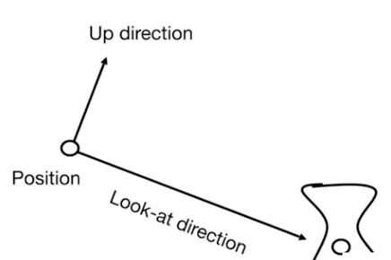
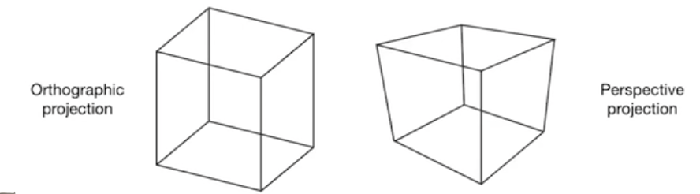
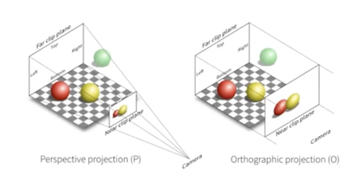
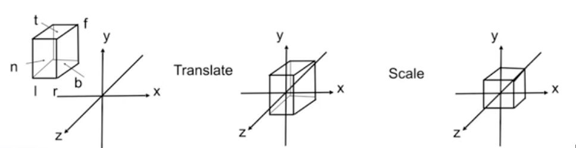
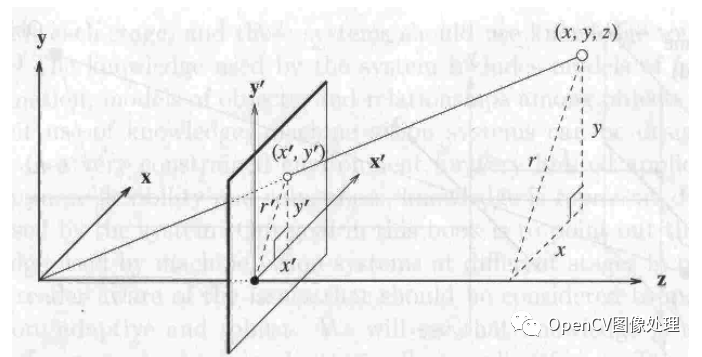
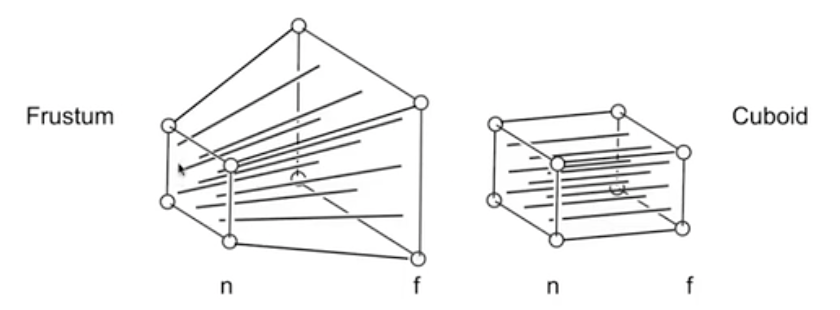
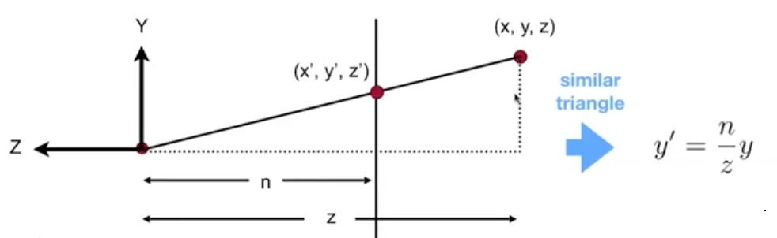

# 3D变换

从2D我们可以把所有变换都推广到3D，我们这里主要讨论下旋转：

#### 罗德里格斯旋转公式(Rodrigues' Rotation Formula)

如果我们希望绕着轴 n 旋转角度 a, 那么有：
$$
R(n,\alpha) = cos(\alpha)I + (1-cos(\alpha))nn^T + sin(\alpha)
\underbrace{
\begin{pmatrix}
0&-n_z&n_y\\
n_z&0&-n_x\\
-n_y&n_x&0
\end{pmatrix}
}_N
$$

## 使用变换变换坐标系（点不变，变换坐标系）

1. 将一个带有局部坐标系的物体放到世界坐标系中的一个位置的变换称为“模型变换”
2. 从世界坐标系向观察坐标系的变换称为“观察变换”

我们可以先简单的找一个例子，如果两个轴平行的坐标系（即坐标系仅是平移关系），此时若我们如果希望将坐标系1中的点（x,y,z,1），变换到坐标系2中，记为(x',y',z',1)。（注意此时x'y'z'数据也是相对坐标系1原点的）, 于是有：
$$
\begin{bmatrix} x' \\ y' \\ z' \\ 1 \end{bmatrix} = \begin{bmatrix} 1&0&0&-T_x \\ 0&1&0&-T_y \\ 0&0&1&-T_z \\ 0&0&0&1 \end{bmatrix}\begin{bmatrix} x \\ y \\ z \\ 1 \end{bmatrix} = T_{12}=(T_{21})^{-1}
$$
其中，T21是坐标系2到坐标系1的变换（数据为坐标系2的）， T12是坐标系1到坐标系2的变换， 而且我们会发现，这个情况在加入旋转后，也是适用的。

于是得出一个比较重要的叙述：   **通常旧坐标系变换到新坐标系需要的变换，是在当前坐标系中，将旧轴引入到新轴中的变换的逆。**

# 视图变换/MVP变换 （View Transformation）

什么是视图变换？ 我们可以设想一下拍摄照片时候的场景：

- 找到一个好的场景，安排人站到合适位置（模型变换， **M**odel Transform）
- 找到一个好的“视角”来进行拍照（视图变换， **V**iew/Camera Transform）
- 拍摄照片！（投影变换， **P**rojection Transform）

所以有的时候，我们也把这些变换统称为 “MVP变换”

## 模型变换

把模型的所有顶点，乘与仿射矩阵后，就可以换算出实际顶点位置。

## 视图/相机变换

在做视图变换前，我们需要先定义一个摄像机(观测矩阵)，矩阵至少应该具备三个向量/点

- Eye Position: e

- Look-at/ gaze direction:  g

- Up direction: t

  

我们知道，如果相机和所有物品一块移动，那么拍摄结果应该是一样的。

所以我们干脆把相机的位置就设置到原点(0,0,0) ,并且 y轴为向上的轴（y轴正方向）， 且 look at -Z 轴（z轴负方向）， 然后用变换所有物品到摄像机坐标系下的方式来计算，计算就会更加简单可行。

故此，我们目标矩阵M，可以用下面方式来推导出来：

首先计算移动到原点的向量 T
$$
T_{\text{view}}=\begin{bmatrix}1&0&0&-x_e\\0&1&0&-y_e\\0&0&1&-z_e\\0&0&0&1\end{bmatrix}
$$
然后计算旋转 g 到 -Z轴,    旋转 t 到 Y轴，（gxt）到 X轴， 但是我们会发现这不太好写， 

但是因为旋转矩阵是正交矩阵，所以我们不妨考虑使用 逆矩阵：

旋转 X轴 到(gxt)，Y轴到t， Z轴到-g， 后求出逆矩阵于是：
$$
R^{-1}_\text{view} = 
\begin{bmatrix}
x_{g \times t} & x_t & x_{-g}&0\\
y_{g \times t} & y_t & y_{-g}&0\\
z_{g \times t} & z_t & z_{-g}&0\\
0&0&0&1
\end{bmatrix}\\
R_\text{view} = 
\begin{bmatrix}
x_{g \times t} & y_{g \times t} & z_{g \times t}&0\\
x_t & y_t & z_t&0\\
x_{-g} & y_{-g} & z_{-g}&0\\
0&0&0&1
\end{bmatrix}\\
$$

于是最终的变换M即可由下面求出：
$$
M_{\text{view}}=R_{\text{view}}T_{\text{view}}
$$
求出M后，我们就可以把任意物品换算到相机坐标系下，方便后续的投影计算。

## 投影矩阵（Projection Transform）

投影分为两种投影：正交投影(orthographic projection) 和 透视投影(perspective projection)

可以观察到 正交投影几条变均平行（符合现实，适用工程制图，不会近大远小）

透视投影则几条边延长后会有交点（符合人眼远近观察成像， 近大远小）。

两种投影的成像方法如下

**透视矩阵**，指的就是这么一个“降维”的转换过程, 目的就是把三维场景，变为“二维”。

设想下一个在3维空间里的3D模型，它必然拥有一些顶点信息，设其中任意顶点的坐标为(x,y,z,1)（后面的1是齐次坐标），当我们需要把这个模型投影到某个平面上时，它就从3维变成了2维，而顶点坐标(x,y,z,1)则变成(x,y,d,?)。

可以注意到，经过透视变换后的顶点，依然是四维的形式，只是含义变了，其中的(x,y)分量指的是这个顶点在投影平面上的坐标(显然是因为投影平面相当于一个2维坐标系)。d指的是这个投影点的深度(depth)，d一般是规范化的，我们约定范围是[-1,1]。d的作用在下一个渲染阶段(Depth Test)大有用处。而后面的?，无法一言蔽之，下文会讲到这个问题。

若矩阵A既是对称矩阵，又是幂等矩阵，则称A为**投影矩阵**

### 正交/正射投影(orthographic projection)

正交投影可以认为是透视投影的一种极端模式，即平移投影到目标, 一般可用于工程制图，进行准确测量 

一种简单的理解方式：

- 把摄像机放到原点， 看向-Z轴（Z轴负向）， Y轴向上
- 然后丢弃掉Z的坐标
- 平移和缩放(z) 的结果矩形到 [-1,1]²

实际的处理方式：

- 把一个区域[l,r]x[b,t]x[f,n] 中数据，平移，缩放到一个标准立方体 （canonical cube） [-1,1]³ 中
- l:left, r:right,  b:bottom , t:top, f:far,  n:near

具体的矩阵处理方式： 平移中心到原点，然后把长宽高都缩放到2
$$
M_{\text{ortho}}=
\begin{bmatrix}
\frac{2}{r-l}&0&0&0\\
0&\frac{2}{t-b}&0&0\\
0&0&\frac{2}{n-f}&0\\
0&0&0&1
\end{bmatrix}
\begin{bmatrix}
1&0&0&-\frac{r+l}{2}\\
0&1&0&-\frac{t+b}{2}\\
0&0&1&-\frac{n+f}{2}\\
0&0&0&1
\end{bmatrix}
$$

### 透视投影(perspective projection)

可以参考照相机照相的情况， 投影点近大远小， 主要用于模拟视觉

首先我们先回顾一下齐次坐标的概念：

（x,y,z,1） (kx,ky,kz, k≠0), (xz,yz,z²,z≠0) 都表示三维中的同一个点 (x,y,z)

例如： (1,0,0,1)  (2,0,0,2) 都表示同一个点 (1,0,0)

#### 视锥体 Frustum

视锥体，指的是一个有限的椎体空间，处于这个视锥体里的对象，才是“可见”的对象，可见的对象会被渲染到“视平面”上（三维到二维的投影）。视锥体有4个参数：

- aspect ratio，简称ar，ar = 视平面width/视平面height
- （vertical）field of view，简称fov，指yz平面的视角大小，即下文的αα角。
- near Z Plane，简称near面，是一个平行于xy平面的面，世界坐标系下是一个浮点值，可以用来裁剪太靠近摄像机的物体
- far Z Plane，简称far面，含义类似near面，可以用来裁剪太远离摄像机的物体

视平面可以认为是视锥体的near面；far面相对来说并没有那么重要，因为我们知道人眼的“视锥体”是没有far面的（比如裸眼可以看到月亮星星，far面其实是无限远的），在图形学中，far面主要是用来裁剪太过遥远的物体、提高渲染效率的

#### 透视投影矩阵的推导？

- 首先我们需要定义一个名为  “视锥体(Frustum)” 的形状， 如下图：

- 然后把 Frustum 形状挤压成  cuboid 形状（近平面不变； 远平面z不变，中心点不变，平面收缩）,计算出透视到正交投影的变换矩阵
  $$
  M_{\text{persp} \rightarrow \text{ortho}}
  $$
  

- 接下来拿到 cuboid 后，就可以当做正交投影来计算最终结果了。

#### 如何计算透视到正交投影的变换矩阵？

首先我们可以尝试就只看其中一个侧面截图，我们可以有下面结论：

于是我们也能类似的找到以下关系
$$
y'=\frac{n}{z}y \ \ \ \ \ \ \ \ \ 
x'=\frac{n}{z}x
$$
于是我们要做到事情就是，先尝试找到一个变换M，可以满足以下等式：
$$
M^{(4 \times 4)}_{\text{persp} \rightarrow \text{ortho}}
\begin{pmatrix}x'\\y'\\z'\\1\end{pmatrix} = 
\begin{pmatrix}nx\\ny\\?\\z\end{pmatrix}
\xleftarrow{\text{multiply by z, 这两个表达方式是等价的}}
\begin{pmatrix}nx/z\\ny/z\\?\\1\end{pmatrix}
$$
这样的话，我们就能先填充好M的一部分：
$$
M^{(4 \times 4)}_{\text{persp} \rightarrow \text{ortho}}=
\begin{pmatrix}n&0&0&0\\0&n&0&0\\?&?&?&?\\0&0&1&0\end{pmatrix}
$$
接下来我们来计算缺失的z， 首先我们知道，近平面的z是肯定不会变的，不涉及z移动。

于是我们可以知道，变换前后，z‘ 和 z相同， 于是对于 近平面(n)而言, 我们可以有： z'=z=n
$$
M^{(4 \times 4)}_{\text{persp} \rightarrow \text{ortho}}
\begin{pmatrix}x'\\y'\\n\\1\end{pmatrix} = 
\begin{pmatrix}nx\\ny\\n^2\\z\end{pmatrix}
\xleftarrow{\text{multiply by z}}
\begin{pmatrix}nx/z\\ny/z\\n\\1\end{pmatrix}
$$
于是我们能断定，M 矩阵的第三行应该符合如下（根据矩阵乘法推断， 要得到n² 结果肯定是和 x、y 无关的，于是断定前面两位为0）：
$$
\begin{pmatrix}
0&0&A&B
\end{pmatrix}
\begin{pmatrix}
x\\y\\n\\1
\end{pmatrix}
=n^2

\ \ \ \ \ \ \ \ \    An+B=n^2
$$
再接下来，同理我们也可以观察一个特殊的点，就是远平面的中点， 这个点经过变换后，肯定也是保持不变的。于是我们可以有：
$$
M^{(4 \times 4)}_{\text{persp} \rightarrow \text{ortho}}
\begin{pmatrix}0\\0\\f\\1\end{pmatrix} = 
\begin{pmatrix}0\\0\\f^2\\f\end{pmatrix}
\xleftarrow{\text{multiply by z}}
\begin{pmatrix}0\\0\\f\\1\end{pmatrix}

\ \ \ \ \ \ \ \ \ \ \  \ \ \

\begin{pmatrix}
0&0&A&B
\end{pmatrix}
\begin{pmatrix}
0\\0\\f\\1
\end{pmatrix}
=f^2
\ \ \ \ \ \ \ \ \ 
Af+B=f^2
$$
结合这两个公式，我们就可以确定 AB的值：
$$
\begin{cases}An+B=n^{2}&\\ Af+B=f^2&\end{cases} 
\Rightarrow\ \ \ \ 
\begin{cases}A=n+f\\ B=-nf\end{cases}
$$
于是我们得到矩阵M为：
$$
M^{(4 \times 4)}_{\text{persp} \rightarrow \text{ortho}}=
\begin{pmatrix}n&0&0&0\\0&n&0&0\\0&0&n+f&-nf\\0&0&1&0\end{pmatrix}
$$
接下来，我们就只需要在这个基础上，继续叠加之前的正交矩阵变换，即可得到最终的透视变换矩阵了！
$$
M_{\text{persp}} = M_{\text{ortho}}M_{\text{persp} \rightarrow \text{ortho}}
$$

#### 最终形式

$$
M_{\text{persp}} =
\begin{bmatrix}
\frac{2}{r-l}&0&0&0\\
0&\frac{2}{t-b}&0&0\\
0&0&\frac{2}{n-f}&0\\
0&0&0&1
\end{bmatrix}
\begin{bmatrix}
1&0&0&-\frac{r+l}{2}\\
0&1&0&-\frac{t+b}{2}\\
0&0&1&-\frac{n+f}{2}\\
0&0&0&1
\end{bmatrix}
\begin{bmatrix}n&0&0&0\\0&n&0&0\\0&0&n+f&-nf\\0&0&1&0\end{bmatrix}
$$

