# 3D到2D的转换原理

### 投射 canonical cube 到屏幕（光栅化）

**屏幕**

- 屏幕就是一系列像素点构成的平面
- 这些像素点的行列数量就是**分辨率**（resolution）
- 屏幕就是一种典型的光栅成像设备（raster display）

Raster： (德语中的屏幕的意思)


**光栅化**(**Rasterize**):  把目标绘制到屏幕上


**像素点**( **Pixel** ,  short for "picture element")

- 一个像素就是一个有混合颜色的小方块
- 颜色是由红绿蓝三色混制而成


**屏幕空间（screen space）**

首先我们先绘制一个如下坐标系，这里可能和其他地方有所区别，y是向上的，主要是因为上文我们默认采用的是右手坐标系，所以这里y自然是向上。

- 我们用一个二维整数元组来（x,y）来表示每个像素， 比如下图蓝色方块是(2,1)
- 这里像素的索引应该是（0,0）到（width-1,height-1）
- 而每一个像素点的中点实际值应该是 (x+0.5,y+0.5)
- 这样这些像素就刚好覆盖了 width*height 的一块屏幕

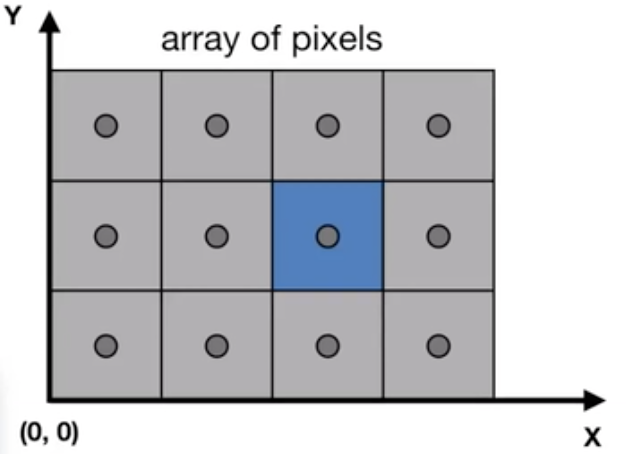


**变换Canonical Cube 到 屏幕**

- z轴是无关紧要的
- 我们只需把 xy 平面 [-1,1]² 变换到 [0,width]x[0,height] 即可

于是我们可以得到如下的变换矩阵：
$$
M_{\text{viewport}}=
\begin{pmatrix}
\frac{\text{width}}{2} & 0 & 0 & \frac{\text{width}}{2}\\
0 & \frac{\text{height}}{2} & 0 & \frac{\text{height}}{2}\\
0&0&1&0\\
0&0&0&1\\
\end{pmatrix}
$$


### 成像设备（Draw Machine）

这里要注意的是，模型不仅只能绘制到屏幕(光栅)， 我们还可以用下面设备来进行绘制：

- CNC(Sharpie Drawing Machine)
- Laser Cutters (激光雕刻机)
- Oscilloscope (示波器)
- LCD、OLCD...
- Eletronic Ink 墨水屏

需要注意的是，这些设备的显示方式是和光栅是很不太一样的


### 绘制形状到光栅

使用三角形网格表示mesh

为何使用三角形？

- 三角形是最基础的形状
- 三角形能唯一确定一个平面
- 三角形能方便的确定一个点是否在内部,  不会存在 凹凸多边形问题
- 可以定义三角形三个点的属性， 做一些渐变关系，用重心坐标做插值


**如何根据三角形的顶点数据，判断哪些像素需要被点亮，以及大概的值， 就是光栅化最重要部分。**

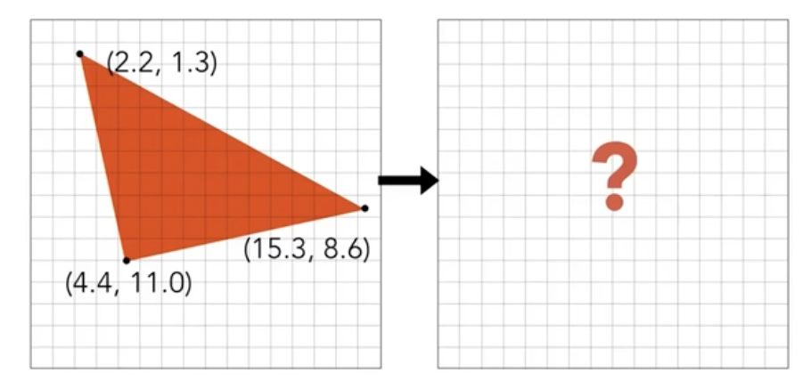

### 采样(Sampling)

对每一个点计算一个值的方法就是采样

```java{
for(int x=0;x<xmax;++x){
  output[x]=f(x);
}
```

采样是图形学中一个重要概念， 我们可以对时间(1D),区域(2D),方向(2D),体积(3D)等等进行采样


### 屏幕空间采样/栅格化原理

我们在屏幕空间上的采样的目标，就是判断屏幕上的像素，哪些像素是在三角形之内

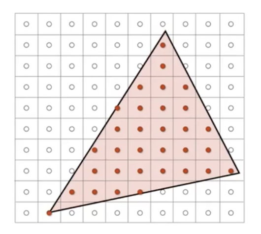

我们把这个采样函数先定义为  inside(tri,x,y):
$$
\text{inside}(t,x,y)=
\begin{cases}
1& \text{Point}(x,y)\  \text{in triangle t}\\
0& \text{otherwise}
\end{cases}
$$
于是，一个最简单的通过采样进行光栅化过程代码就可以这么编写：

```java
for(int x=xmin;x<xmax;++x){
  for(int y=ymin;y<ymax;++y){
    image[x][y] = inside(tri, x+0.5, y+0.5);
  }
}
```

其中， xmin 、ymin、xmax、ymax 的值我们可以用三角形三个顶点计算包围盒（Axis-aligned bounding box， AABB）来确定， 这么做，是因为我们其实没有必要整个屏幕扫描一遍，只需要扫描三角形覆盖的包围盒区域即可，减小不必要的计算量。


#### 采样函数的实现

现在来看下 inside 函数如何实现：

如果要判断一个点是否在三角形内，我们可以根据之前学的知识进行三次叉乘运算，我们就可以认定该点是否位于三角形内部：

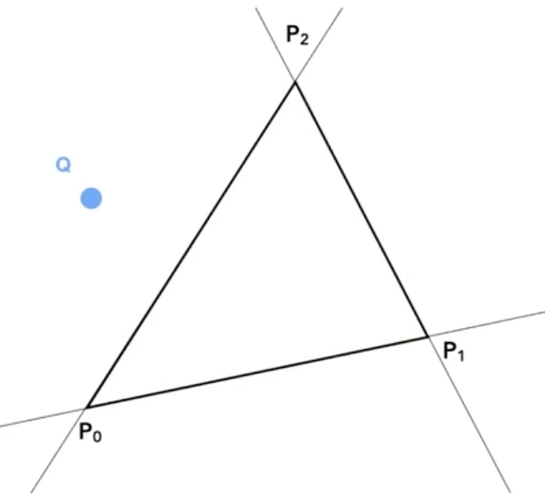

如图，判断Q点是否在三角形 P0P1P2 内，我们只需要判断：
$$
\overrightarrow{A}=\overrightarrow{P_0P_1}\times\overrightarrow{P_0Q}\\
\overrightarrow{B}=\overrightarrow{P_1P_2}\times\overrightarrow{P_1Q}\\
\overrightarrow{C}=\overrightarrow{P_2P_0}\times\overrightarrow{P_2Q}\\
\text{如果} \overrightarrow{A} \overrightarrow{B} \overrightarrow{C} \text{的 Z 均为正值，则点Q一定在}  \triangle{P_0P_1P_2} \text{内部，反之点Q在外部}
$$

#### 边界情况处理

但是有一种特殊的情况，如果上面的图中，某个点Q既位于三角形1，又位于三角形2的交界边处的时候，比如下图：

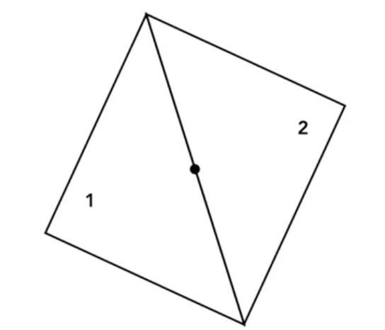

这种时候通常我们可以自己来定义一个规则，来判定这个点是否属于三角形。

比如我们可以就认为既属于三角形1，也属于三角形2。

但一些OpenGL 的库对这种情况规定会相对较严格些，如OpenGL 会规定这种情况下， 如果点落在三角形上边或左边情况就属于三角形，落在下边或右边则不属于三角形。


#### 光栅化的加速处理

可以用一些办法来加速光栅化， 而不必每个点都要依次计算AABB中的每个点。

比如下面的办法适用于计算一些“上窄下宽” 的锐角三角形：

可以从(0,0) 开始计算一行完毕后，如果第一个光栅化的点是(a,b), 那么在第二行的计算我们不需要从(0,1)， 而是可以直接从(a,1)开始。 

因为我们知道三角形上窄下宽，所以a前面的点，一定不会在三角形内部。这样每行就减小了很多工作量。

其次我们扫描每一行的时候，可以扫描到不在三角形内部点时候就停止扫描。这样又能降低一些计算工作了。


### 真实的LCD屏幕像素

真实的屏幕像素并不是一个方块表示的，  

比如可以看到下图右侧 GalaxyS5手机的像素，是一种叫“bayer pattern”交织红绿蓝点排布的屏幕,且绿色点密度及数量要更高一些,；

而左侧iPhone6S 则是红绿蓝构成的一个色块， 且绿色要更宽一点。 （绿色多，主要是因为人眼对绿色会更敏感一些）

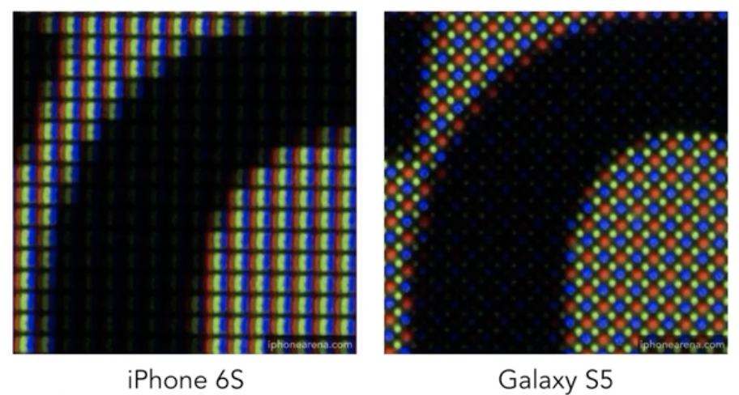


#### 锯齿(jaggies) 问题

因为我们知道，真实的屏幕是一系列小方块构成，所以我们的光栅化最终是吧三角形填充到这些方块里，这样就会形成下面左侧的图片

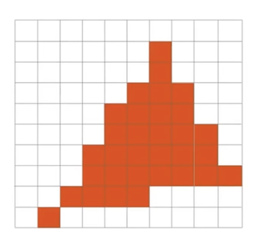 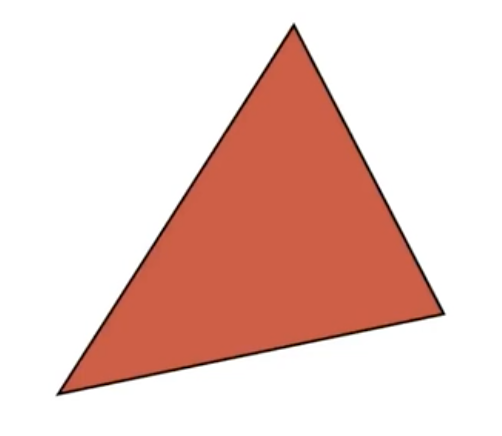

我们发现这个图片与我们希望的目标三角形（右侧图片）其实是有差距的， 会让人感觉边缘有变形，  这就是“锯齿”问题。 这也是图形学需要处理的一个较大的问题。 如果不处理，就会造成某些显出出来的图某些边缘细节走样(aliasing), 比如下面这种情况：

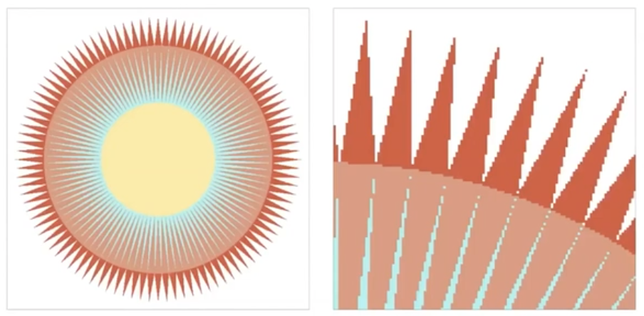

所以后面我们需要对图像进行“反走样”或者“抗锯齿”的处理。


#### 反走样（Antialiasing）

 

**采样误差/瑕疵 Sampling Artifacts(Errors / Mistakes / Inaccuracies) :**  表示在采样中的异常/错误/不准确

Artifact至少以下这些情况：

边缘锯齿（Jaggies ,Staircase Pattern）: 空间采样Artifact


摩尔纹（Moiré Patterns）: 图片欠采样(undersampling) ，奇数行列去除后造成问题

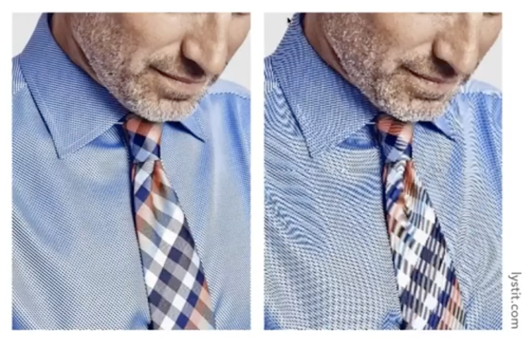


车轮效应(Wagon Wheel Illusion):  时间采样Artifact，  高速运动的车轮看上去是反过来转的，也算是一种采样错误，原因是人眼在时间中采样跟不上运动的速度.

（图略）

当然采样错误还有更多的情况，这里不再列举。

但总结下来，就是 **信号(函数)变换太快(或太高频)，但是采样太慢，速度跟不上**，就会造成 Artifact。


#### 反走样采样（Antialiased Sampling）

先对三角形先进行模糊化，或者滤波，然后再进行采样，就能大概解决锯齿问题。

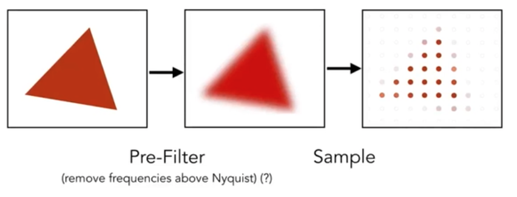

反走样采样后的实际效果：

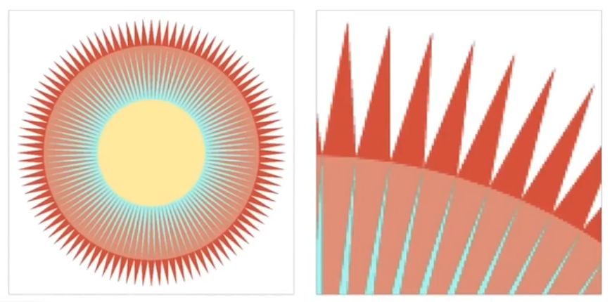

而且需要注意的是，我们一定是要先filter，再sample。 先sample后再filter是不行的。

比如下图， 第一幅图是原图， 第二幅图是 先 filter then sample， 第三幅图是先sample后filter，发现并没有效果(相当于仅只是锯齿被模糊了而已, 故第三幅图这种采样也叫“Blurred Aliasing”）。

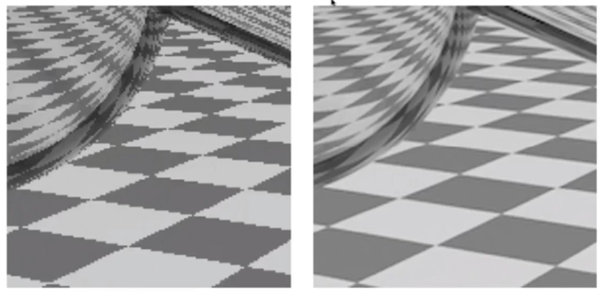	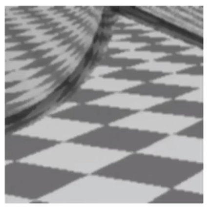


### 频域（Frequency Domain）

#### 傅里叶变换（Fourier Transform）

用一系列加权的余弦和正弦之和来逼近一个方法：

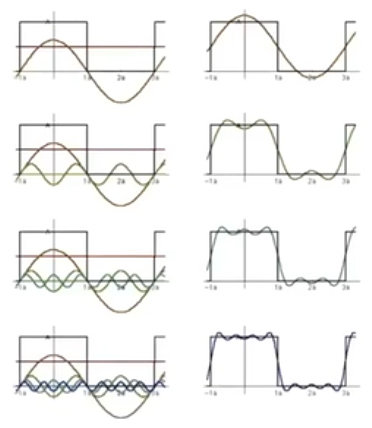
$$
f(x)=\frac{A}{2}
+\frac{2Acos(t\omega)}{\pi}
-\frac{2Acos(3t\omega)}{3\pi}
+\frac{2Acos(5t\omega)}{5\pi}
-\frac{2Acos(7t\omega)}{7\pi}+...
$$


傅里叶变换可以把一个信号分解为频率（时域与频域之间相互转换）：

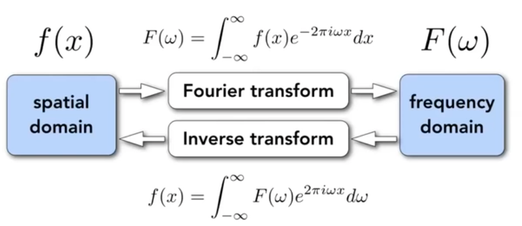
$$
\text{recall:}\ \ \ \  e^{ix}=cosx+i\ sinx
$$


#### “走样”（aliases）的实质

从下图可以得知，频率越高，就需要越快的采样， 否则就会与原来的函数差异过大，即“走样”：

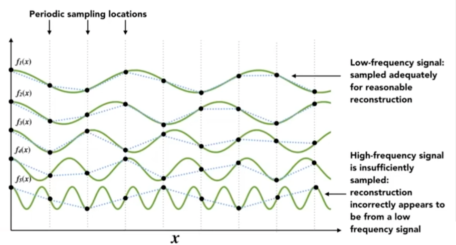


于是我们可以定义一下，什么是“走样（aliases）”: **两个不相同的频率采样后却得到相同的结果**。

比如如下图，我们可看到采样后，蓝色曲线，和黑色曲线采样出来的结果是完全一致的，但是明显蓝色曲线频率比黑色曲线高。

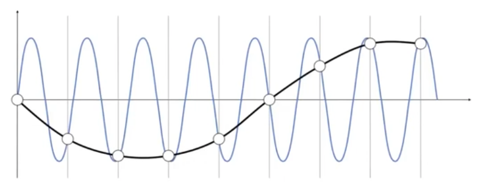


#### 图片的傅立叶变换

如下图，左边是原图，右边是原图经过傅里叶变换后的对应的频域空间的可视化图

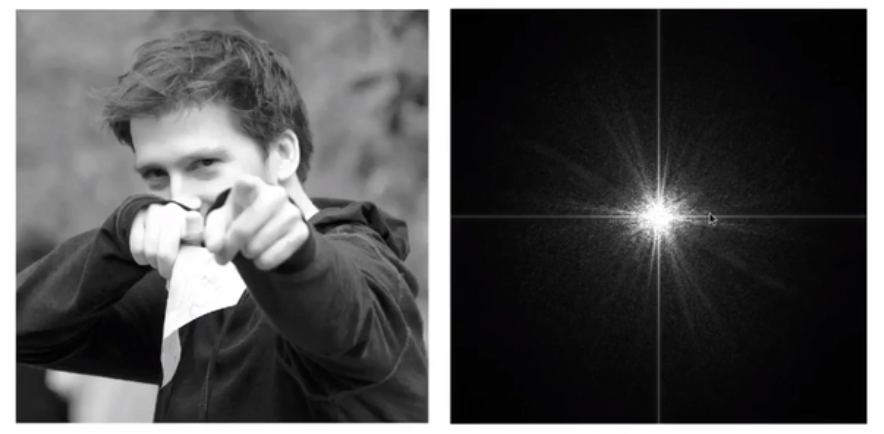

右边的图我们可以这么理解： 就是图片中心是频率最低的地方，越往图片中心走频率越低，越外面则频率越高。

图像我们可以看作是一个定义为二维平面上的信号，而信号的幅值就对应于像素的灰度。 如果我们仅仅看图像的其中一行像素，则可以将之视为是一维空间上的信号。  这个信号和传统意义上的信号处理其实是相似的，只不过一个是定义在时域上的，这个是定义在空间域上的。   图片的频率我们可以理解为图片相邻像素之间的变化剧烈程度。（右边图中间垂直和水平的那两个极长的白线，是因为一般图片最左边和最右边的像素一般不会一样，于是就会造成较大的频率变化，故产生这两条极长的白线，一般我们可以忽略它）


#### 滤波（Filtering）

滤波就是将信号中特定波段频率滤除。

如下图所示，可以把低频滤除后， 图片留下的就是高频部分（内容边缘），这样的滤波方式我们叫“**高通滤波**”（High-pass filter）

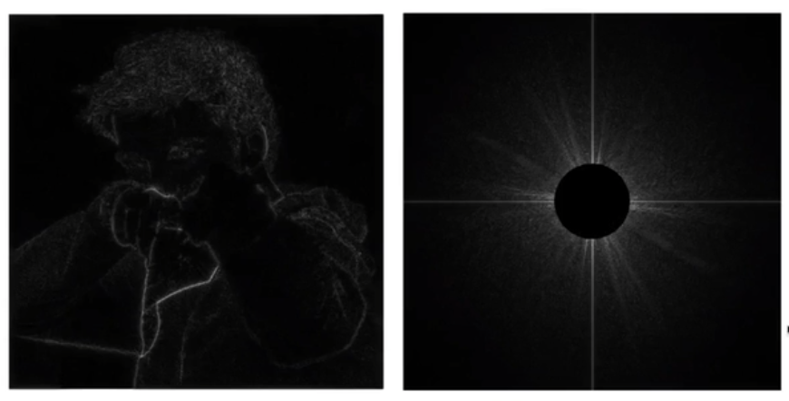

又如下图所示，只留下最低频率的信息，把所有高频信息滤除后， 图片的边界就会显的非常的模糊(Blur)，这样的滤波方式我们就叫“**低通滤波**”（Low-pass filter）

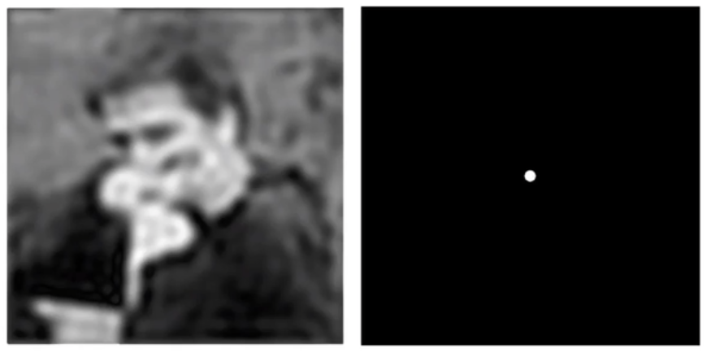

又如下图，如果把高频和低频都过滤掉，只留下中间一段频率，我们也能看到渐变的过程。

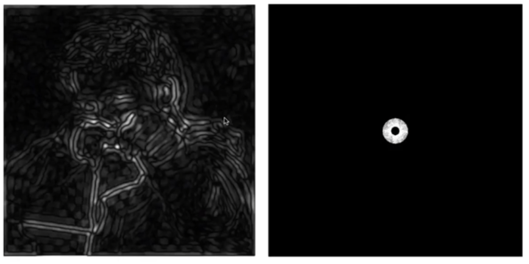

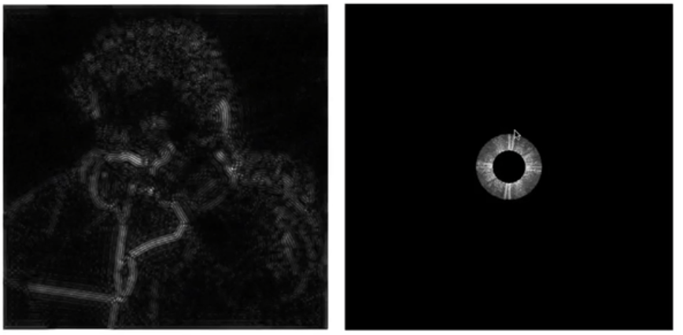


实际上，滤波也可以看作一种卷积的过程    Filtering = Convolution ( = Averaging  )

#### 卷积（Convolution）

卷积可以理解为使用一个Filter矩阵（滤波矩阵），在原来的信号矩阵上进行不断的滑动与点乘，得到一个新的信号矩阵的过程。

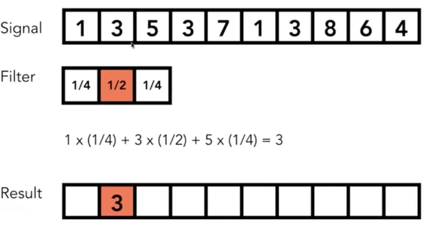


#### 卷积定律（Convolution Theorem）

**在时域上的卷积等于在频域的乘积**， 函数卷积的傅立叶变换是函数傅立叶变换的乘积。

于是，我们可以有两种选择，其实都是相等的。

选择一：

- 在时域上使用适当的滤波器进行卷积操作

选择二：

- 使用傅立叶变换变换到频域
- 把卷积核也使用傅立叶变换变换到频域上，然后在与上者相乘
- 再进行逆傅立叶变换变换回时域

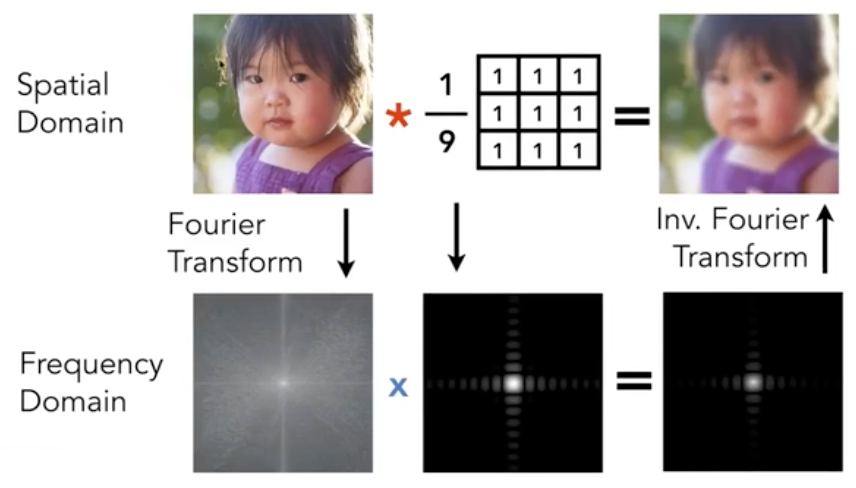

上面的滤波器核，也就是一种“低通滤波器”(Low Pass Filter)


#### 采样/走样的意义

**采样**就相当是重复的频率上的内容（重复一个原始信号的频谱）。

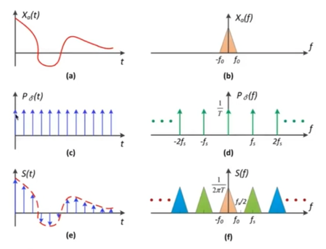

比如上图， 在时域上一个原始的函数 X(t) [a], 乘以一个冲激函数 P(t) [c], 就可以得到采样的目标函数 S(t) [e].

在频域上，X(t) 的频域函数[b] 卷积 冲击函数的频域函数[d], 就可以得到 S(t)的频域函数。

我们就会发现，在频域上，采样其实相当于不断重复原始信号的频谱而已。


**走样**就相当于是采样后的频谱发生了混叠。

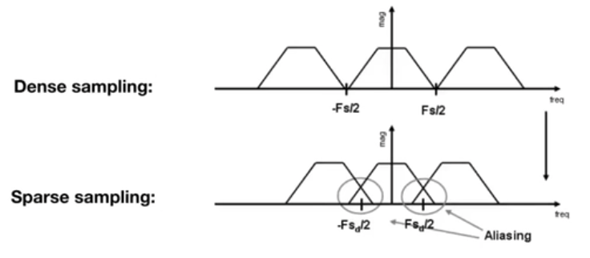

### 反走样的办法

通过以上，我们可以知道，要想减小图片走样，就需要确保采样后的频谱尽可能不发生混叠。有两种处理办法：

方法一： 增加采样率

- 本质上就是在频域上增加了频谱复制的间隔

- 比如使用高分辨率的显示器，传感器，帧缓冲...

- 但是花费较大，也需要较高的分辨率才行

方法二：反走样

- 先模糊，后采样（先低通滤波，去掉高频，然后采样）
- 本质上就是把频域给“窄化”后再进行复制，所以就能避免混叠（如下图）

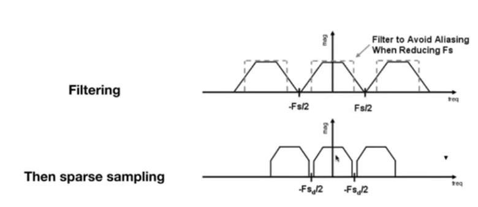


#### 实际具体的反走样采样过程

首先，一个像素宽的box滤波器(低通滤波器，模糊操作)时域和频域的图如下所示

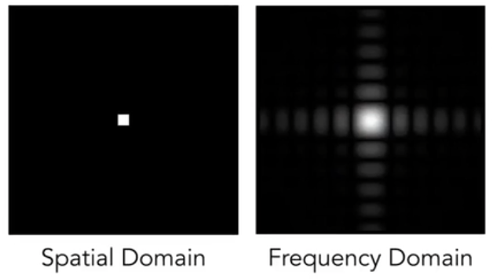

实现过程：

- 对f(x,y) 使用1像素的box-blur 滤波器进行卷积操作
- 然后再对每个像素点的中心进行采样

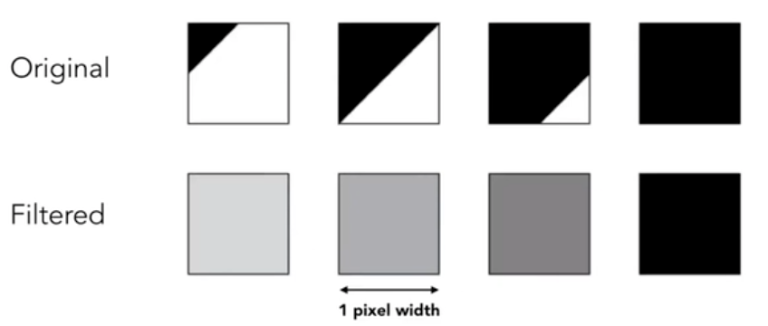

当光栅化每一个像素的时候，每个像素区域 f(x,y)=inside(triangle,x,y) 的均值， 就等于这个像素被三角形覆盖到的这个像素的面积。


### 反走样之超级采样(Supersampling ，Multi-sample Antialiasing MSAA)

对反走样的一种相对较好的办法，过程如下：

首先，对每个像素点进行一次采样

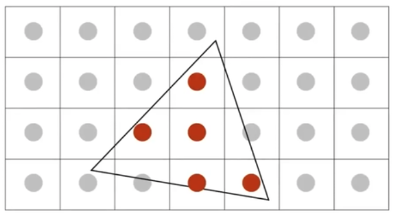

然后再到 每个像素里增加 NxN 的采样点，再次进行采样

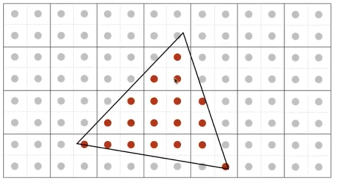

在这之后，我们根据上面两步的计算结果，对每个像素内的NxN的采样点进行一次平均（模糊操作），计算出像素的覆盖率。

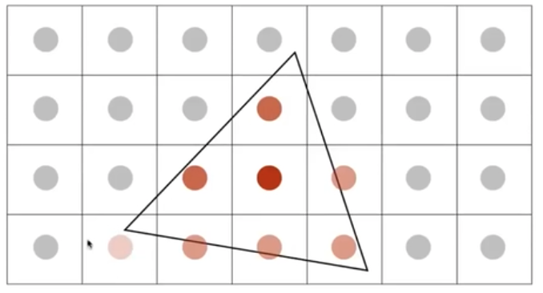

于是我们可以得到下面的结果

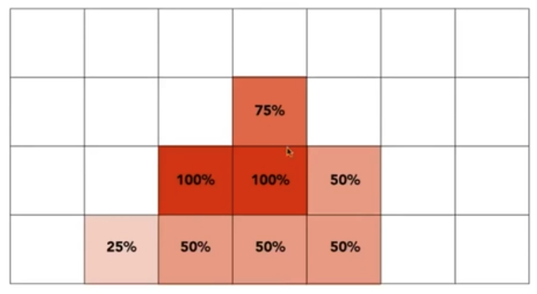


之前提到的这个图片就是一个实际的 4x4 的超级采样的例子：


MSAA 的**缺点**：增大了计算量


#### 现代的反走样过程

- FXAA(Fast Approximate AA) ：识别边缘
- TAA(Temporal AA)  ：复用上一帧的感知到的信息

超分辨率/超级采样

- 低分辨率转高分辨率
- 解决采样不足的问题
- DLSS (Deep Learning Super Sampling)


## 深度缓冲（Z-Burffing）

#### 绘图逻辑

画家绘图是从远到近的方式覆盖作画（画家算法），需要进行一个深度的排序进行（复杂度O(n log n)），但是现在有个比较大的问题，就是如果是下面这种情况，我们无法取得正常的三角形的深度顺序， 因为他们是互相覆盖的, 所以实际我们是不这么绘制的。

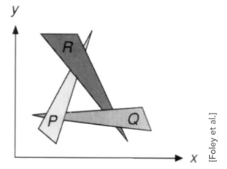

#### 深度缓冲（Z-Buffer)

最终绘制是采用的办法，做法如下：

- 对每个采样像素存储当前的最小的z值
- 增加一个深度缓存：
  - frame buffer 存储颜色值
  - depth buffer(z-buffer) 存储深度信息

重点：简单来说，我们假设z都是正的， z越小就越近，z越大则越远

样例：

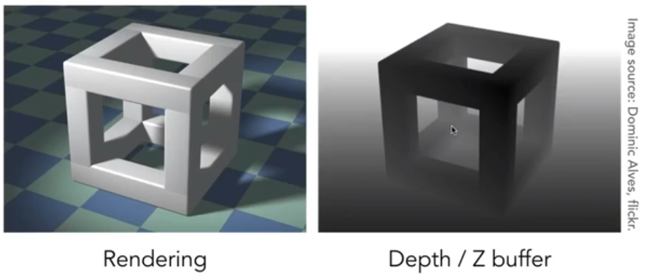

于是在光栅化时候，我们可以这么处理

```java
for(trangle in T){
  for(sample(x,y,z) in T){
    if(z<zbuffer[x,y]){
      //更近，故更新颜色和深度信息
      framebuffer[x,y]=rgb;
      zbuffer[x,y]=z;
    }else{
      //do nothing
    }
  }
}
```

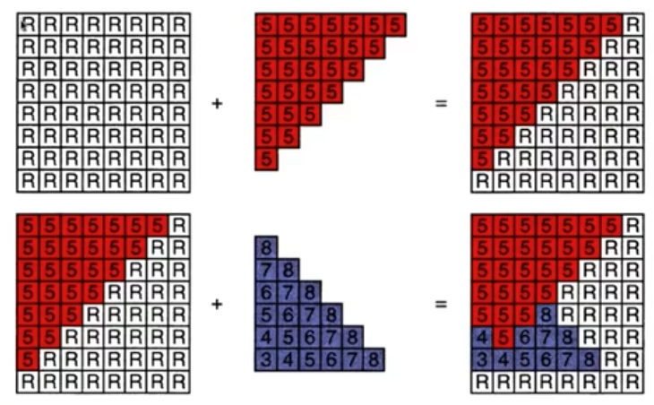

复杂度O(n)


这个算法最好的地方，在于绘制与三角形顺序无关， 并且目前所有GPU都支持。