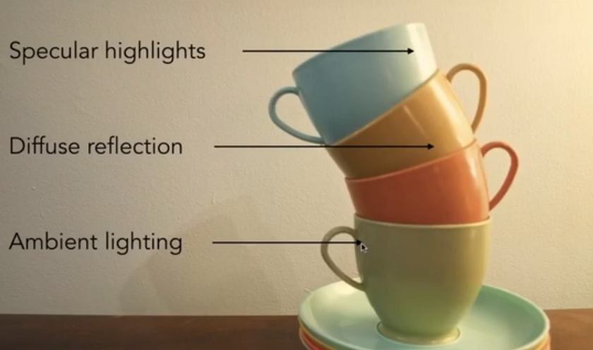

# 着色

**着色**（Shading）：绘画中表示引入明暗颜色的不同， 在图形学中表示对不同物体应用不同材质的过程。

#### 冯氏反射（Blinn-Phong Reflectance Model）:

一个最简单的着色模型，认为光照主要由下面三种光构成：

Specular highlights: 高光（镜面反射光）

Diffuse Reflection : 漫反射光

Ambient Light : 环境光（虚拟的）

