# 几何 Geometry

### 几何表述的类型

几何的表述方式

有很多办法来表述几何, 我们应当选择合适的几何类型来表述不同的场景

**隐式Implicit**

- algebraic surface
- level sets
- Distance functions
- ...

**显式Explicit**

- point cloud
- Polygon mesh
- Subdivision,NURBS
- ...

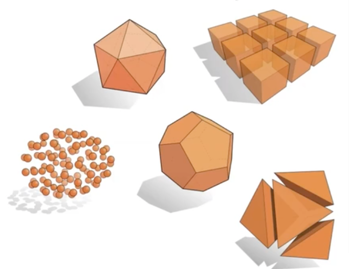

### 隐式几何表述（Implicit Representations of Geometry）

不说明点的具体位置，只说明这些点满足特定的关系，这就是隐式的几何表述。

例如：

在表述 sphere(球型)的3d的所有点时候，我们可以描述为：  x²+y²+z²=1 

更加通用的表述方式，就是满足公式： **f(x,y,z)=0**

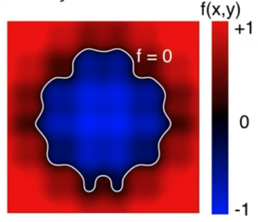

但是隐式的描述也有一些**缺点**，比如下面这个函数， 我们并不容易寻找到满足 f(x,y,z)=0 的函数 f
$$
f(x,y,z)=(2-\sqrt{x^2+y^2})^2+z^2-1
$$
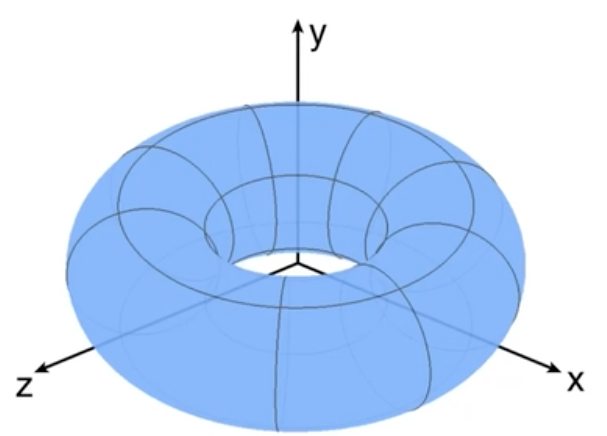

隐式表示的**优点**，就是能比较容易的检测一个点是否在形状的表面上，或者表面内部，或者表面外部。比如：

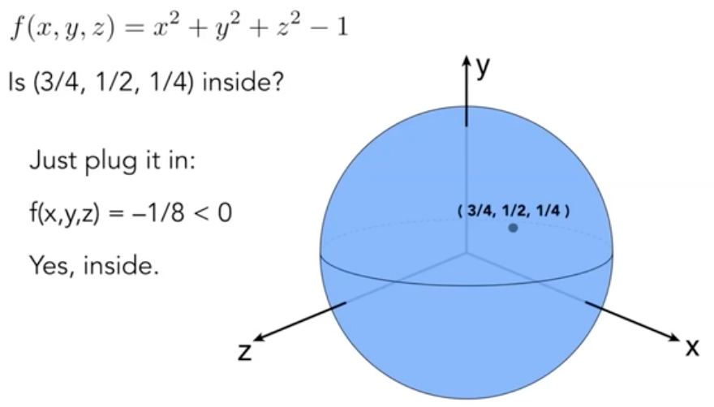

#### 代数表面（Algebraic Surfaces ）

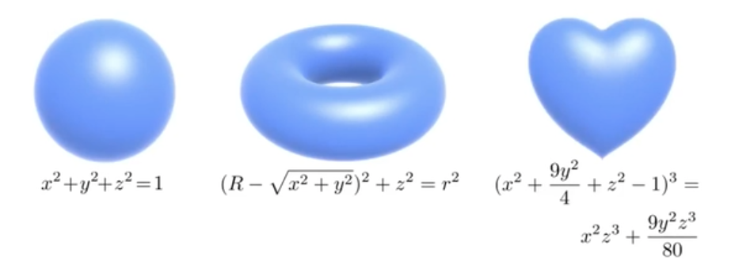

#### 构造实心几何体 (Constructive Solid Geometry, CSG)

对基本几何体进行布尔运算（Boolean operations）得到复杂几何体

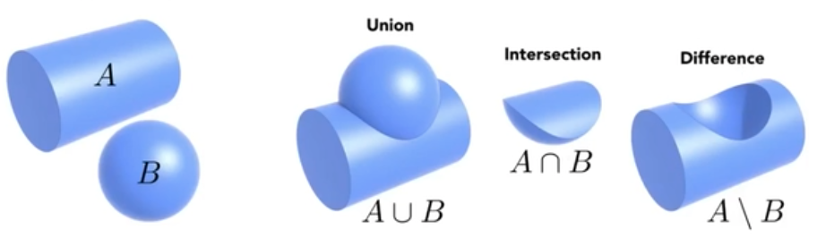

又比如：

  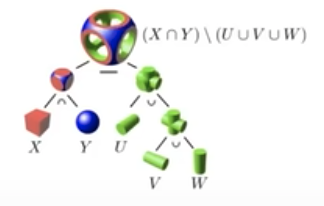

#### 距离场（Distance Functions）

取代布尔操作，用空间中任何一个点到物体的最小距离（也可以是负的距离）来描述一个物体。

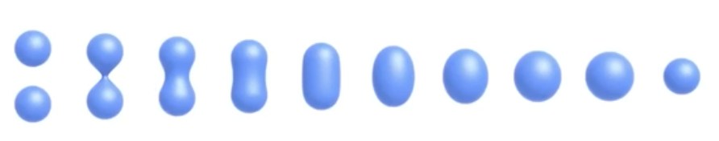

可以混合（Blend）任何两个 距离函数 d1,d2:

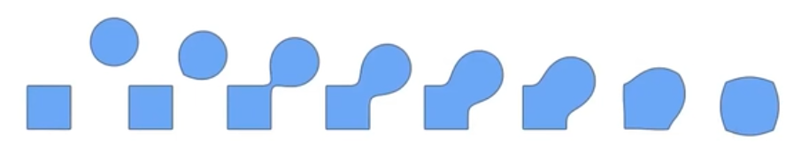

**水平集方法（Level Set Methods）**

对一些复杂形状，不好用距离函数表示的情况，我们可以 

可以通过寻找值等于0的位置，就可以得到整个形状。

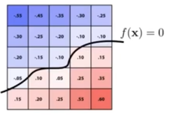

水平集的一些应用

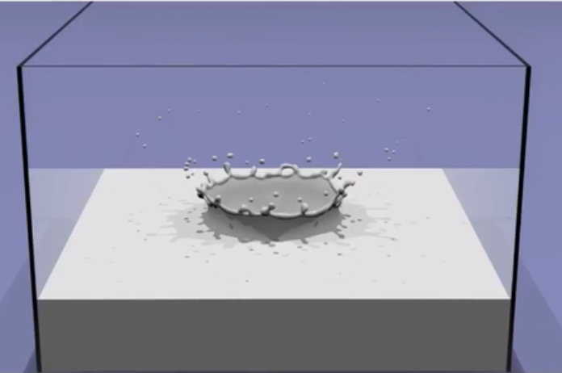 

#### 分型（Fractals)

自相似的形状，用于描述自然现象的一种语言，但是很难控制形状

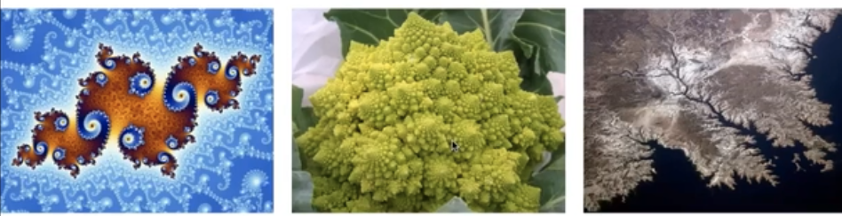

### 显式几何表述（Explicit Representations of Geometry）

直接给出所有点的坐标，或者通过参数映射得到，就是显式的几何表述方式。

例如：

这也是显式的**优点**，如果我们要判断那些点在表面上，只需要计算 f(u,v) 的值即可，上面的公式绘制到3维中，其实就是之前隐式不好表述的环型形状：

但是显式几何的**缺点**也比较明显：难以判断一个点在形状内部，还是外部。

#### 点云(Point Cloud)

用一个点集来表示一个模型

- 容易表达任何形状

- 经常是把点云集转换到几何网格（polygon mesh）来处理

难以

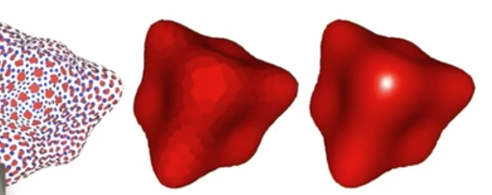

#### 多边形网格（Polygon Mesh)

储存顶点以及形状（通常是三角面或者四边面）

- 比较容易做处理/模拟，以及采样。
- 更复杂的数据结构
- 但也是图形学中运用最广泛的做法

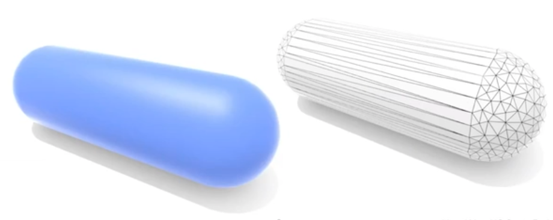

**Wavefront Object File (.obj) Format**

- 通常用作图形学研究的一种数据格式
- 是一个包含顶点，发现，贴图坐标和**它们的连接**的一个文本文件

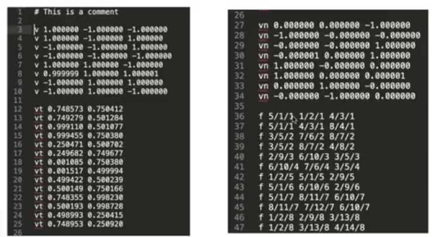

#### 曲线 Curves

摄像机路径（Camera Paths)

矢量字体（Vector Fronts)

#### 贝塞尔曲线（Bézier Curve）

用一系列控制点（一般是四个点），通过插值来定义一条曲线

##### de Casteljau Algorithm

 首先我们定义三个点b0、b1、b2, 我们需要先在 b0b1 的对应t比例位置找到一个点 b01 然后在 b1b2上找到同样的t比例位置找到点b1 ，然后在 b01b11 之间再按照t比例计算出目标点b02。

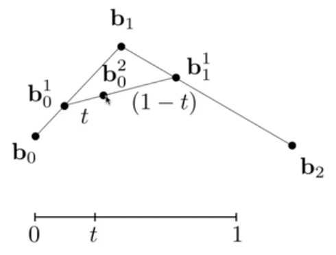

只要我们枚举出所有的t，就可以得到一条曲线。

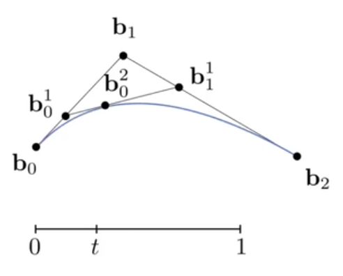

接下来我们从三个点定义到4个点，仍然使用 de Casteljau 算法，于是有：

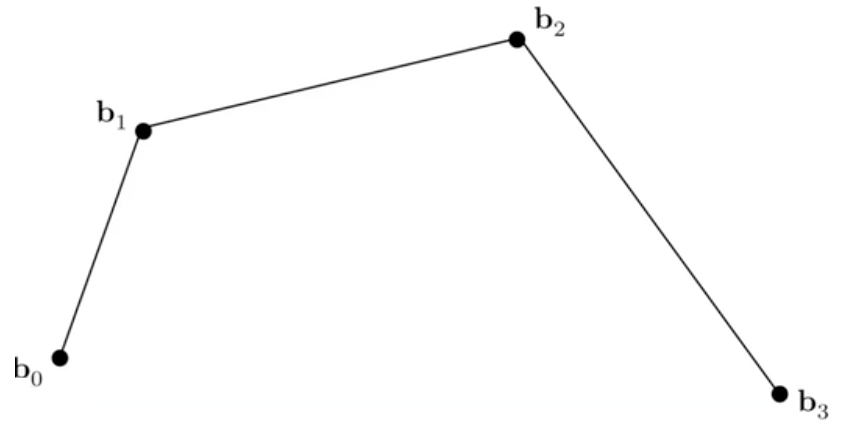
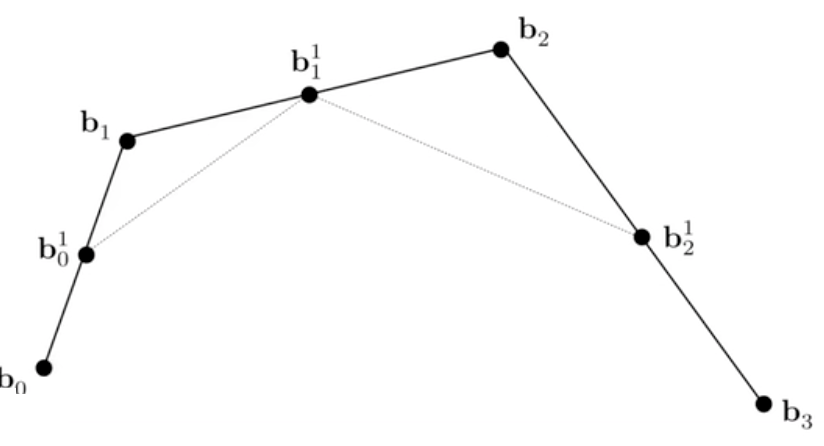
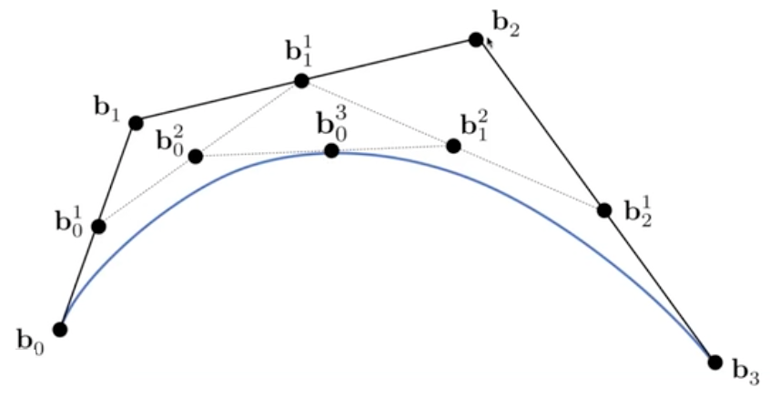
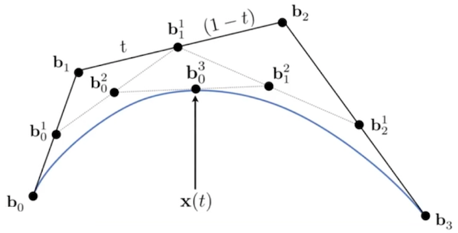

这样我们就可以绘制出一条贝塞尔曲线

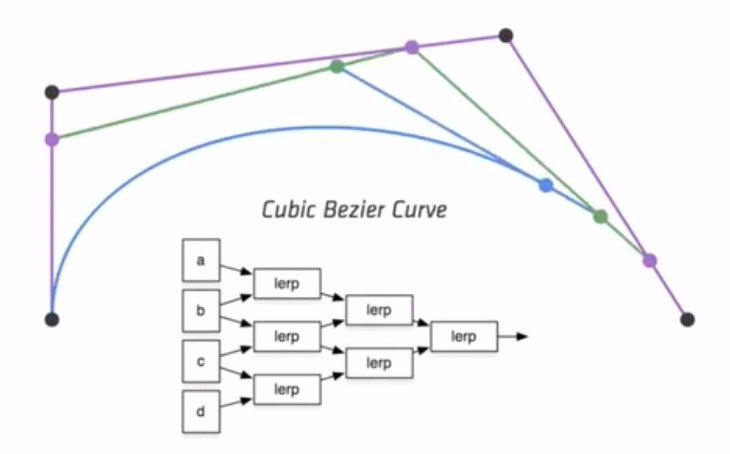

##### 贝塞尔曲线的代数形式

$$
b_{01}(t)=(1-t)b_0+tb_1\\
b_{11}(t)=(1-t)b_1+tb_2\\
\ \\
b_{02}(t)=(1-t)b_{01}+tb_{11}\\
\ \\
b_{02}(t)=(1-t)^2b_0+2t(1-t)b_1+t^2b_2
$$

当给定了n个控制点的时候，我们可以表达为：
$$
b_n(t)=b_{0n}(t)=\sum^{n}_{j=0}b_jB_{nj}(t)
$$
其中 bj 就是贝塞尔的控制点， Bnj(t) 也叫伯恩斯坦多项式（ Bernstein polynomials）:
$$
B_{ni}(t)=C^i_nt^i(1-t)^{n-i}
$$
这样，我们就可以把贝塞尔曲线扩展到不仅是局限在2d上的定义， 我们可以往3d进行推广。

例如， 我们假设控制点如下：
$$
b_0=(0,2,3)\ \ b_1=(2,3,5)\ \ b_2=(6,7,9)\ \ b_3=(3,4,5)
$$
那么根据之前的表达式，我们可以展开为：
$$
b_{0n}=b_0(1-t)^3+b_13t(1-t)^2+b_23t^2(1-t)+b_3t^3
$$
这样我们就能通过4个不同的点计算出一个空间中的贝叶斯曲线。

##### 贝塞尔曲线的特性：

- 起点和终点一定等于第一个和最后一个控制点

$$
b(0)=b_0\ \ ;\ \  b(1)=b_3
$$

- 对于三次的贝塞尔曲线，第一个点的导数等于3倍b1-b0值：

$$
b'(0)=3(b_1-n_0)\\
b'(1)=3(b_3-n_2)\\
$$

- 对贝塞尔曲线的仿射变换等于对贝塞尔曲线的控制点进行仿射变换后再绘制出来的曲线

  （但是要注意的是，投射变换并不满足这个性质）

- 凸包（Convex Hull）性质： 贝塞尔曲线一定在几个控制点形成的凸包内

##### 逐段（Piecewise）贝塞尔曲线

虽然我们已经知道了贝塞尔曲线可以用多个控制点绘制，但是实际在做的时候，会发现比较难以控制。比如下图， 我们会发现控制点并不能很好的“控制”贝塞尔曲线的走向。

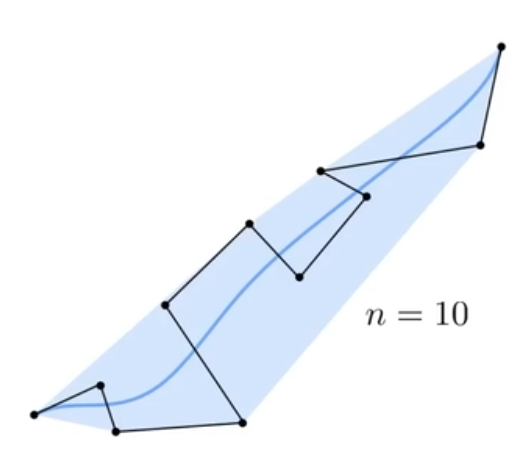

所以这个时候，我们就要引入“逐段贝塞尔曲线”的概念， 在描述一个贝塞尔曲线的时候， 我们没有必要使用“连续的控制点的来绘制贝塞尔曲线”， 而是“每四个控制点绘制一条贝塞尔曲线，然后再把这些曲线段拼接起来”的办法（如下图曲线，就是由三条贝塞尔曲线给拼接起来的）。 这样控制点就能更好的控制曲线的走向了， 也是业界公认的做法。

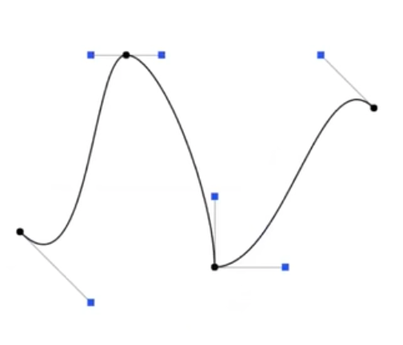

贝塞尔曲线被广泛的用于描述 字体、路径、矢量图、笔记等...

##### C0连续（continuity):

当两条贝塞尔曲线连接的时候，如果两条贝塞尔曲线满足第一个线段终点等于第二条线段起点，就是C0连续。
$$
a_n=b_0
$$
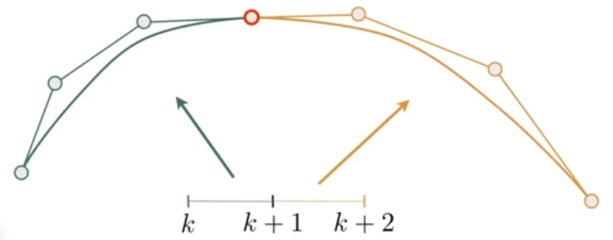

##### C1连续:

在满足C0连续的基础上，如果这个连续点刚好是各自曲线前后一个点的中点，我们就叫 C1连续：
$$
a_n=b_0=\frac{1}{2}(a_{n-1}+b_1)
$$
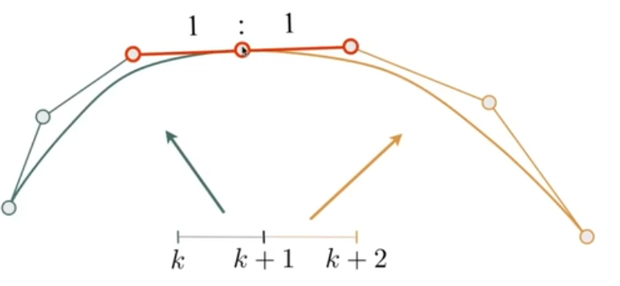

#### 样条曲线（Spline Curves）

给定一组控制点而得到一条曲线，曲线的大致形状由这些点予以控制，一般可分为插值样条和逼近样条两种，插值样条通常用于数字化绘图或动画的设计，逼近样条一般用来构造物体的表面。

##### B-样条曲线（B-Spline， Basis Spline）

对贝塞尔曲线的一个扩展。

B样条曲线曲面具有几何不变性、[凸包](https://baike.baidu.com/item/凸包)性、保凸性、[变差](https://baike.baidu.com/item/变差/5887279)减小性、局部支撑性等许多优良性质，是[CAD系统](https://baike.baidu.com/item/CAD系统/9920658)常用的几何表示方法，因而基于测量数据的[参数化](https://baike.baidu.com/item/参数化)和B样条曲面重建是[反求工程](https://baike.baidu.com/item/反求工程/6481622)的研究热点和关键技术之一。

##### 非均匀有理数样条曲线（NURBS）

#### 贝塞尔曲面

下面图片是一个由4x4数组控制的贝塞尔曲面

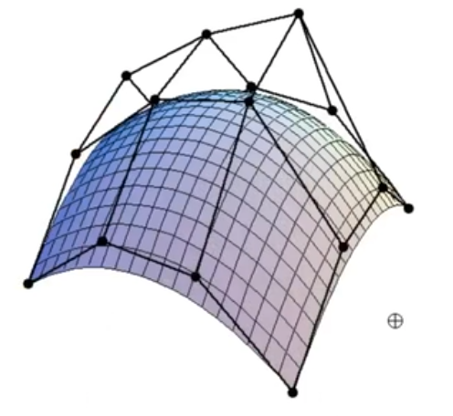

x方向的四条贝塞尔曲线上的四个点作为y方向贝塞尔曲线的控制点绘制y方向贝塞尔曲线绘制而出。

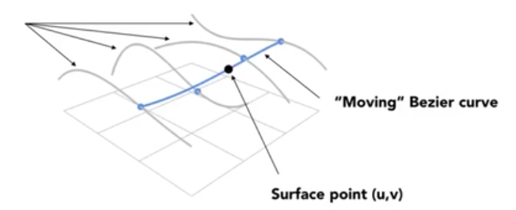

### 网格控制（Mesh Operations）: 几何处理

- 网格细分（Mesh Subdivision）： 下图3
- 网格化简（Mesh Simplification)： 下图4
- 网格正则（规整）化（Mesh regularization）：下图5

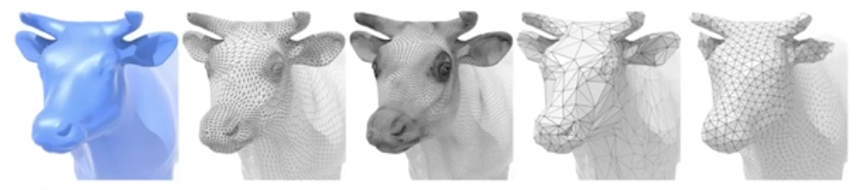

#### 网格细分

增加分辨率

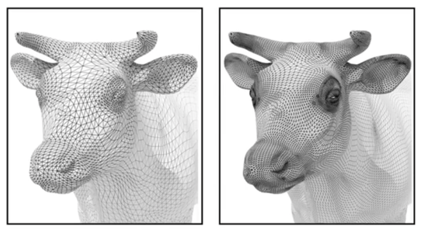

##### Loop Subdivision

- 把一个三角形分成四个三角形

  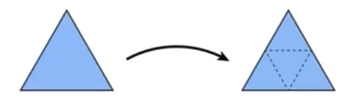

- 根据权重更新新老顶点位置

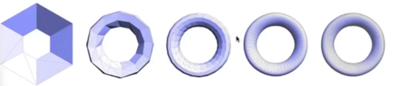

如下，我们根据ABCD四个点位置，计算出白色点的新的顶点如右侧公式。

这样就能让新的点更加平滑一些。

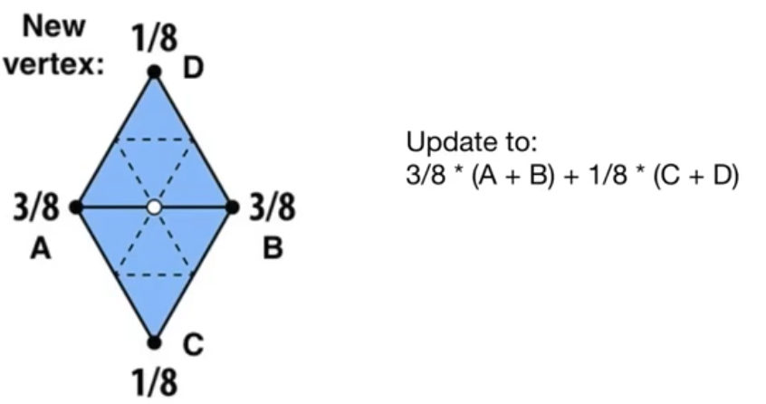

然后对于老的顶点，如下面的白色老顶点，n表示顶点的“度”（即连接到顶点的边的数量）可计算出老顶点需要更新到的位置

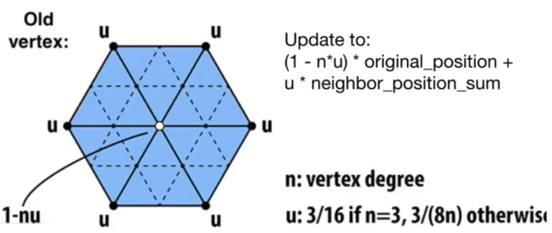

##### Catmull-Clark Subdivision(General Mesh)

对非全三角形网格进行细分的一种算法，如下，我们先对紫色的两个顶点，即度不为4的点定义为奇异点。

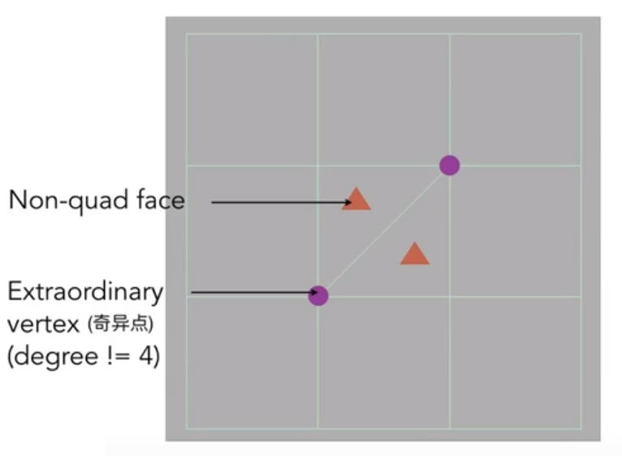

具体做法： 取每条边的中点，和形状的中点（可以是重心点，不重要）连接起来，如下：

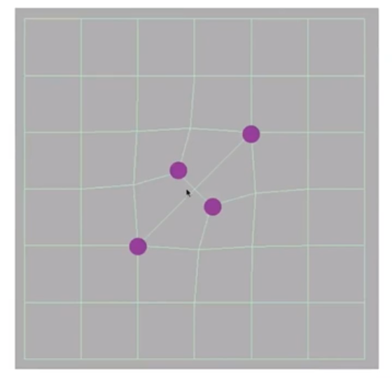

性质：在做一次细分时会增加一倍奇异点，且所有三角面会变为四边面。但是再细分，奇异点数量就不会增加了，且以后都是四边面。

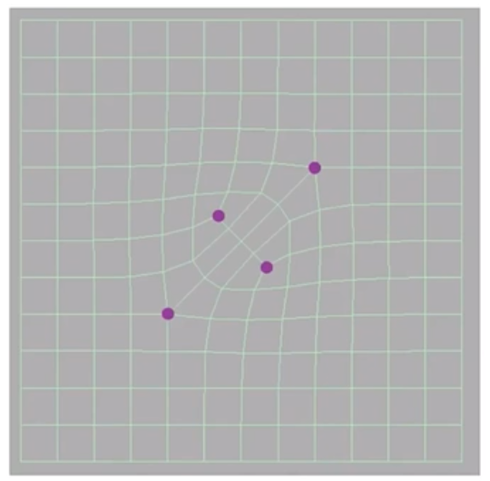

点的更新策略：

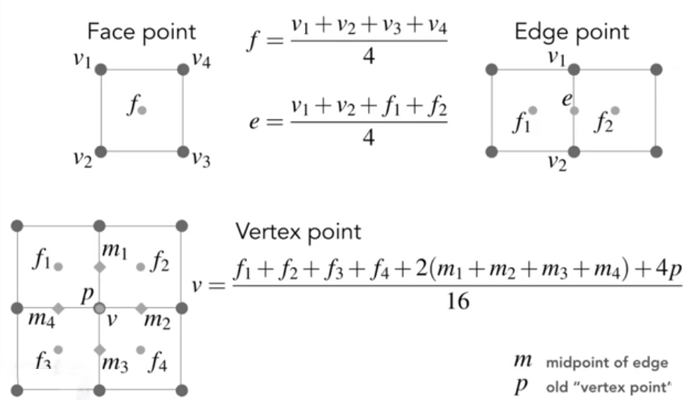

Catmull-Clark 细分的优势，就在于不一定非要对三角面进行细分：

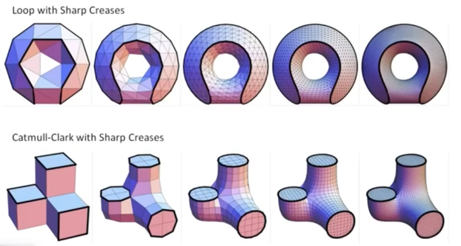

 

#### 网格简化

降低分辨率，但尝试维持形状及外观

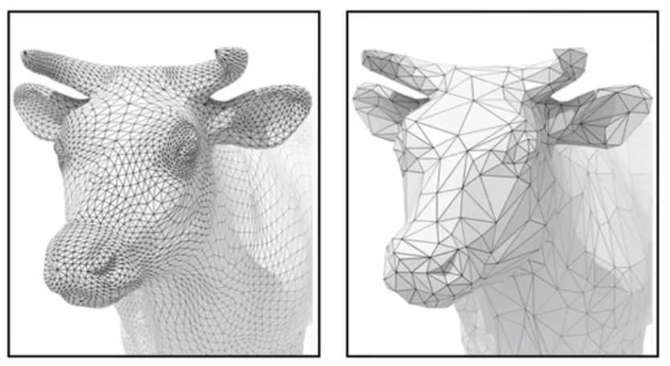

目标：在维持形状的前提下简化网格数量。

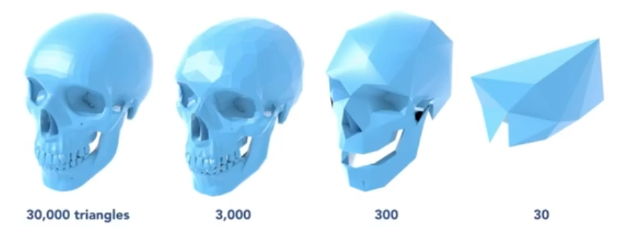

##### 边坍缩（Coilapsing An Edge）

简化网格的其中一种算法。

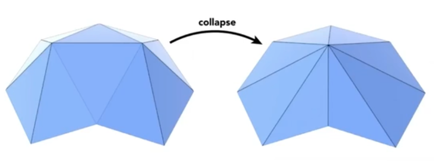

##### 二次误差度量（Quadric Error Metrics）

- 取要删除的点的平均位置并不是一个好的想法。
- 二次误差： 新的顶点应该是它的 sum of square distance (L2 distance), 来保证和以前的面尽可能接近。

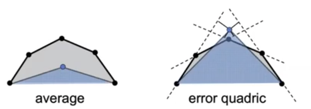

坍缩的过程：

二次度量误差小的优先探索

#### 网格正则化

修改顶点的分布以改善质量, 但是不改变外观

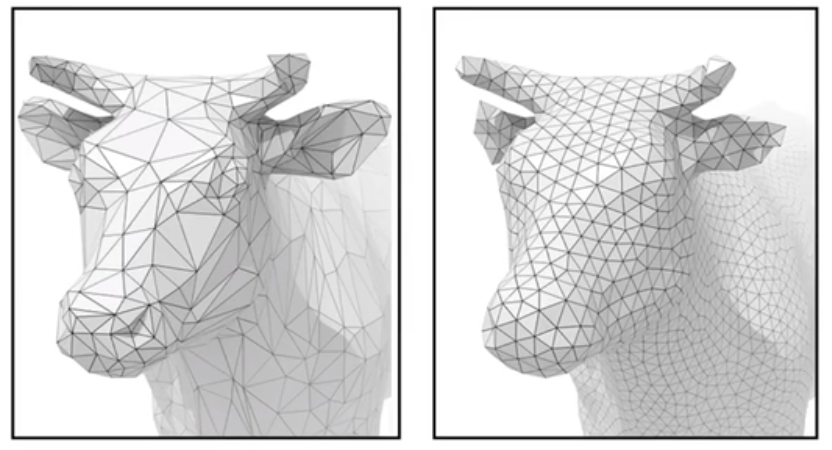

