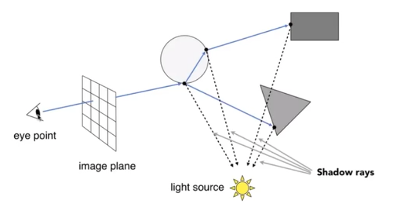
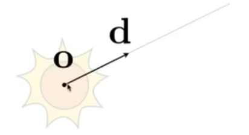
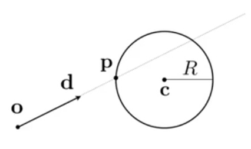
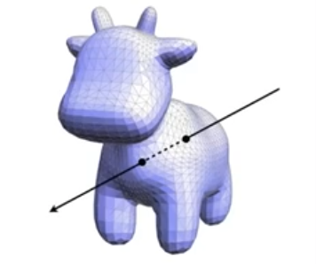
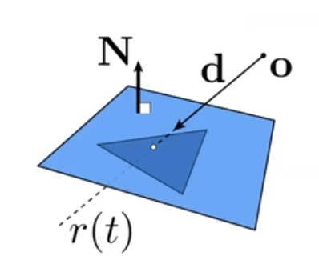
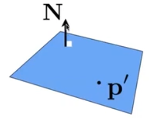

# 光线追踪（Ray Tracing)

## 递归光线追踪（Recursive Ray Tracing）

### 光线-表面交点计算 Ray-Surface Intersection

光线：我们定义光线是由一个原点和一个方向向量构成。如下图

这里满足： 
$$
r(t)=o+td\ \ \ \ \  0 \leq t < \infin
$$

### 光线如何与不同物体求交

#### 球体

Sphere: 假设交点在p，那么应该满足：
$$
(p-c)^2-R^2=0
$$

结合射线定义，我们可以有：
$$
(o+td-c)^2-R^2=0
$$
于是可以求解得到：


$$
at^2+bt+c=0\\
\ \\
\begin{aligned}
a= & d \cdot d\\
b= & 2(o-c) \cdot d\\
c= & (o-c) \cdot (o-c)-R^2\\
t= & \frac{-b \pm \sqrt{b^2-4ac}}{2a}
\end{aligned}
$$
我们首先要保证的是有实数解，故要满足。b^2-4ac 大于等于0 时候才会有解（交点）

#### 光线与隐式表面的交点

通过上面的写法，我们可以把这个求交过程推广到普通的隐式表面求交：
$$
\begin{aligned}
\text{Ray: } & r(t)=o+td\ \ \ \ \  0 \leq t < \infin\\
\text{Implicit surface, p : } & f(p)=0\\
\text{substitue ray equation: } & f(o+td) = 0\\
\text{then solve for real, positive roots}
\end{aligned}
$$

#### 光线与显式表面的交点

- 最简单的想法： 就吧每个三角形依次判断是否有交点， 但是这样就会比较的慢。
- 我们主要考虑光线与三角形有 0，1 个交点， 忽略多个交点的情况

##### 射线与三角形面相交的计算

直接计算与三角面相交是比较麻烦的， 但是我们知道三角面是在一个平面内的，所以我们可以这么处理：

- 先计算射线与平面的交点
- 然后再检测这个交点是否在三角形内部即可

如何定义一个平面？  我们就定义平面上的任意一个点 p', 和平面的法线N 构成一个平面。 于是有：

$$
(p-p') \cdot N = 0
$$
(如果任意一个点p在平面上，那么点p-p' 这个向量一定与法线N垂直,  其实这个式子展开后，其实就是平面的几何表达式)

于是我们就可以这么来求解交点：
$$
\text{Ray: } r(t)=o+td\ \ \ \ 0 \le t < \infin \\
\text{Plane p: } (p-p') \cdot N = 0\\
\text{Solve for intersection:  } \text{  set   } p=r(t) \text{, so:}\\
(o+td-p')\cdot N = 0
$$

于是最终结论是：
$$
t=\frac{(p'-o)\cdot N}{d \cdot N}
$$
这里要确保 t大于等于0才是有效解。

于是我们就可以解出光线与平面的交点了。

接下来我们再判定目标点是否有交点即可。

##### Möller-Trumbore 算法（MT算法）

我们其实还有比上面方法更快的一个计算方案：使用重心坐标（barycentric coordinate） 直接计算得到目标。
$$
\overrightarrow{O}+t \overrightarrow{D} = (1-b_1-b_2) \overrightarrow{P_0}+ b_1\overrightarrow{P_1} + b_2 \overrightarrow{P_2}
$$
上面的公式里，其中 O是射线原点，D是射线向量， 等号左侧就是射线

等号右侧b1、b2是三角形重心坐标， 这里我们只需要解出 t、b1 b2 即可， 然后这里我们有：
$$
\begin{bmatrix}
t\\b_1\\b_2
\end{bmatrix}
=
\frac{1}{\overrightarrow{S_1} \cdot \overrightarrow{E_1}}
\begin{bmatrix}
\overrightarrow{S_2} \cdot \overrightarrow{E_2}\\
\overrightarrow{S_1} \cdot \overrightarrow{S}\\
\overrightarrow{S_2} \cdot \overrightarrow{D}\\
\end{bmatrix}
$$
其中
$$
\overrightarrow{E_1} = \overrightarrow{P_1} -  \overrightarrow{P_0}\\
\overrightarrow{E_2} = \overrightarrow{P_2} -  \overrightarrow{P_0}\\
\overrightarrow{S} = \overrightarrow{O} -  \overrightarrow{P_0}\\
\overrightarrow{S_1} = \overrightarrow{D} \times  \overrightarrow{E_2}\\
\overrightarrow{S_2} = \overrightarrow{S} \times  \overrightarrow{E_1}\\
$$
于是只要 t>=0,  b1>0, b2>0,  1-b1-b2>0 才能说明点在三角形内。

#### 性能优化

上文提到，我们如果把射线和每个三角形依次求交，那就会造成计算量非常之大，计算十分的缓慢。所以我们就需要进行加速。

##### 包围体积（Bounding Volumes)

一个相对简单的办法来避免碰撞检测：

- 物体会完全在包围体积中。
- 如果射线不会与包围体积碰撞，那么它肯定不会与目标物体碰撞。
- 所以我们可以先测试包围体积的碰撞，如果碰撞了，我们再测试物体的碰撞。

