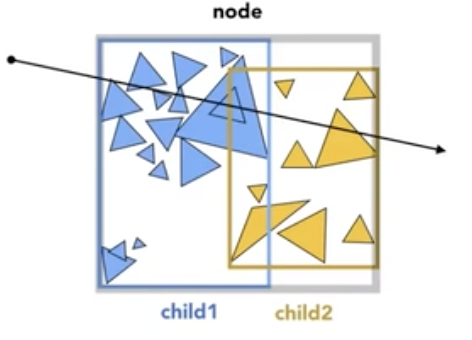

# 光线追踪（Ray Tracing)


## 递归光线追踪（Recursive Ray Tracing）


### 光线-表面交点计算 Ray-Surface Intersection

光线：我们定义光线是由一个原点和一个方向向量构成。如下图


这里满足： 
$$
r(t)=o+td\ \ \ \ \  0 \leq t < \infin
$$


### 光线如何与不同物体求交

#### 球体设定

Sphere: 假设交点在p，那么应该满足：
$$
(p-c)^2-R^2=0
$$


结合射线定义，我们可以有：
$$
(o+td-c)^2-R^2=0
$$
于是可以求解得到：


$$
at^2+bt+c=0\\
\ \\
\begin{aligned}
a= & d \cdot d\\
b= & 2(o-c) \cdot d\\
c= & (o-c) \cdot (o-c)-R^2\\
t= & \frac{-b \pm \sqrt{b^2-4ac}}{2a}
\end{aligned}
$$
我们首先要保证的是有实数解，故要满足。b^2-4ac 大于等于0 时候才会有解（交点）


#### 光线与隐式表面的交点

通过上面的写法，我们可以把这个求交过程推广到普通的隐式表面求交：
$$
\begin{aligned}
\text{Ray: } & r(t)=o+td\ \ \ \ \  0 \leq t < \infin\\
\text{Implicit surface, p : } & f(p)=0\\
\text{substitue ray equation: } & f(o+td) = 0\\
\text{then solve for real, positive roots}
\end{aligned}
$$


#### 光线与显式表面的交点


- 最简单的想法： 就吧每个三角形依次判断是否有交点， 但是这样就会比较的慢。
- 我们主要考虑光线与三角形有 0，1 个交点， 忽略多个交点的情况

##### 射线与三角形面相交的计算

直接计算与三角面相交是比较麻烦的， 但是我们知道三角面是在一个平面内的，所以我们可以这么处理：

- 先计算射线与平面的交点
- 然后再检测这个交点是否在三角形内部即可


如何定义一个平面？  我们就定义平面上的任意一个点 p', 和平面的法线N 构成一个平面。 于是有：


$$
(p-p') \cdot N = 0
$$
(如果任意一个点p在平面上，那么点p-p' 这个向量一定与法线N垂直,  其实这个式子展开后，其实就是平面的几何表达式)

于是我们就可以这么来求解交点：
$$
\text{Ray: } r(t)=o+td\ \ \ \ 0 \le t < \infin \\
\text{Plane p: } (p-p') \cdot N = 0\\
\text{Solve for intersection:  } \text{  set   } p=r(t) \text{, so:}\\
(o+td-p')\cdot N = 0
$$

于是最终结论是：
$$
t=\frac{(p'-o)\cdot N}{d \cdot N}
$$
这里要确保 t大于等于0才是有效解。

于是我们就可以解出光线与平面的交点了。

接下来我们再判定目标点是否有交点即可。


##### Möller-Trumbore 算法（MT算法）

我们其实还有比上面方法更快的一个计算方案：使用重心坐标（barycentric coordinate） 直接计算得到目标。
$$
\overrightarrow{O}+t \overrightarrow{D} = (1-b_1-b_2) \overrightarrow{P_0}+ b_1\overrightarrow{P_1} + b_2 \overrightarrow{P_2}
$$
上面的公式里，其中 O是射线原点，D是射线向量， 等号左侧就是射线

等号右侧b1、b2是三角形重心坐标， 这里我们只需要解出 t、b1 b2 即可， 然后这里我们有：
$$
\begin{bmatrix}
t\\b_1\\b_2
\end{bmatrix}
=
\frac{1}{\overrightarrow{S_1} \cdot \overrightarrow{E_1}}
\begin{bmatrix}
\overrightarrow{S_2} \cdot \overrightarrow{E_2}\\
\overrightarrow{S_1} \cdot \overrightarrow{S}\\
\overrightarrow{S_2} \cdot \overrightarrow{D}\\
\end{bmatrix}
$$
其中
$$
\overrightarrow{E_1} = \overrightarrow{P_1} -  \overrightarrow{P_0}\\
\overrightarrow{E_2} = \overrightarrow{P_2} -  \overrightarrow{P_0}\\
\overrightarrow{S} = \overrightarrow{O} -  \overrightarrow{P_0}\\
\overrightarrow{S_1} = \overrightarrow{D} \times  \overrightarrow{E_2}\\
\overrightarrow{S_2} = \overrightarrow{S} \times  \overrightarrow{E_1}\\
$$
于是只要 t>=0,  b1>0, b2>0,  1-b1-b2>0 才能说明点在三角形内。


### 性能优化/加速结构

上文提到，我们如果把射线和每个三角形依次求交，那就会造成计算量非常之大，计算十分的缓慢。所以我们就需要进行加速。


#### 包围体积（Bounding Volumes)

一个相对简单的办法来避免碰撞检测：

- 物体会完全在包围体积中。
- 如果射线不会与包围体积碰撞，那么它肯定不会与目标物体碰撞。
- 所以我们可以先测试包围体积的碰撞，如果碰撞了，我们再测试物体的碰撞。


#### 射线与包围盒（Box）相交的算法

盒的定义：我们可以认为，盒是3对板（slab）（或者说是三对平面）  相交得到。


我们通常用的包围盒一般使用轴对齐包围盒（Axis-Aligned Bounding Box ,AABB）: Bounding Box 的每一个侧面都各自与 xyz轴平行

我们先从2D开始推导（3D也是一样的）。首先我们先定义光线在x平面的交点线段为 tmin ～tmax,如下图所示： 


我们同样也能看到在y平面上的交点线段 tmin～ tmax：(注意这t也可以为负，我们假设可以有这种情况，最后再判断t合理性)


我们要取的，是两线段的交集，也就是最终的碰撞结果：


由上述的思想，我们可以推广到3D情况，于是能得到关键的想法：

- 射线一定要进入**所有对** slabs 后，才一定是在盒子内。
- 只要射线离开**任意一对** slabs 之后，射线一定就离开盒子了。

于是，对于任意一对 slabs，我们先计算出。tmin tmax, 并暂时不管负数情况。

于是我们可以认为：
$$
t_{\text{enter}} = max\{t_{\text{min}}\}\\
t_{\text{exit}} = min\{t_{\text{max}}\}\\
$$
对于判断正确性， 我们首先要明确一点，就是 射线并不是一条直线。所以我们要符合物理规律。

- 当 t_exit < 0:   Box 一定在 ray 之后， 所以这种情况肯定是没有交点的。
- 当 t_exit >=0 and t_enter<0:   我们可以认为  ray 的原点一定是在 Box 内部的， 故这种情况是有交点的。
- 当 t_enter > 0:  肯定是有交点

所以总结下来，ray 和 AABB 相交的判定条件就是：
$$
t_{\text{enter}} < t_{\text{exit}} \ \ \ \text{and} \ \ \  t_{\text{exit}} \ge 0
$$


##### 为什么要选择 AABB 作为包围盒？ 

因为正常的射线与平面相交的解法是：


$$
t=\frac{(p'-o)\cdot N}{d \cdot N}
$$
这里有 3次减法，6次乘法， 1次除法运算

而 垂直于x轴的Slabs 的解法是：


$$
t=\frac{p'_x-o_x}{d_x}
$$
这里只用到了一次减法，一次除法， 效率更高。

#### 加速网格（Acceleration Grid)

预处理： 构建加速网格
1. 先找到场景的包围盒
    
2. 对包围盒创建网格
    
3. 对网格里的每个单元格（Cell）进行重叠判定（Overlapping），判定那些格子里有物体

4. 然后我们按照光线传播方向，与每一个含有物体的单元格进行光线相交测试。  如果含有物体的单元格与光线有相交，则继续测试单元格内物体与光线的交点。取得最终准确的交点。


##### 格子的分辨率（Grid Resolution)

我们可以推导得知，上面的加速架构里，格子太密/太稀疏 都会造成加速并不完美， 按照一般的经验，格子数量一般是。C* obj 的数量。 在3D中 C 一般取27.

##### 适用范围

适用于场景物件分布均匀的情况，比如连续的草地等

不适用分布十分不均匀的场景，比如足球场中的一个足球， 空气会浪费很多格子的计算。


#### 空间划分（Spatial Partitions）


八叉树（Oct-Tree): 空间平均划分8块，每个小块再划分8小块。。。

KD树（KD-Tree)： 空间水平分2块，再每个子块里再垂直分2块，每个子块再水平分2块。。。

BSP树（BSP-Tree)：每次按照某个方向切分为2块，再每个子块再按照某个方向再切分2块。。。


##### KD-Tree 的预处理

我们先按照其中一半来进行处理（另一半也需要做一样的过程）


对于非叶子节点（internal nodes），需要存储的数据：

- 切分轴（x-, y- or z-axis)

- 切分位置：沿着轴的坐标平面

- 子节点： 指向切分后的子节点

- **中间节点不存储任何物体**

对于叶子节点（leaf nodes）存储：

- 物体列表

##### KD-Tree 如何加速光线追踪（Traversing a KD-Tree)


首先我们先判定 光线是否会和 A 有交点， 如果有，就证明光线会与 1、B 也有交集。


然后我们继续判定光线是否会与子节点1相交，可以看到光线与1也会相交。 这里我们假设1不在进行划分（实际上是需要继续划分的），那么1应该是KD树的叶子节点，这个时候我们就需要让光线，对叶子节点中的所有物品进行相交判断。


然后继续检测和B的相交， 判定是否有交点，如果有交点就继续往下，如果没有就停止返回。 如果遇到叶子节点就检测包含的物体，没有遇到子节点就继续往下，依次类推。。。


这样我们就能对整个场景使用类似二分查找的方式，尽快的完成光线碰撞的判断。

但是这里也存在两个较大的问题：

- 如何判定物体在划分的网格里？

- 物体可能同时存在多个网格里，


#### 物体划分（Object Partitions） & Bounding Volumn Hierarchy（BVH）

KD-Tree 我们知道存在两个个较大的问题，为了更近一步解决这种问题，人们发明了用物体来划分的方式。也是目前使用的方案。

首先，我们取得这些三角形的外包盒。

 

现在把这些三角形，分为2部分后，再重新计算这两部分的包围盒。


我们再继续对每一块三角形进行划分，并求出包围盒， 直到划分的每个子节点内物体数量小于到一定的数量后才停止（比如5个）。


这样就解决了KD-Tree 里，物体会出现在多个格子的情况。

但是这里也有一个问题，就是我们划分并不是完美的把空间划分为多部分，会有重叠。

##### 如何划分一个节点？

- 选择一个维度来划分
- 启示1: 总是沿着节点最长的轴来划分
- 启示2: 按中间物品来划分（把物品排序后，找中位数， 主要是为保证这个树平衡）

##### BVH Traversal



```javascript
Intersect(Ray ray, BVH node){
  if(ray missed node.bbox) return;
  
  if(node is a leaf node){
    test intersection with all objs;
    return closest intersection;
	}
  
  hit1 = Intersect(ray, node.child1);
  hit2 = Intersect(ray, node.child2);
  return the closer of hit1, hit2;
}
```

