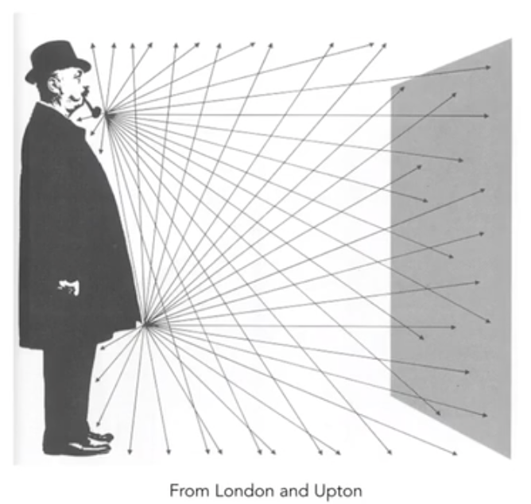

# 辐射度量学（Radiometry）

准确的度量3D光照的属性。

这里引入几个新词汇：

Radiant Flux、intensity、irradiance、radiance

### 辐射能量 Radiant Energy And Flux(Power)

辐射能量（Radiant Energy）：指电磁波中电场能量和磁场能量的总和。 用焦耳做度量 Q[J = Joule]

辐射通量（Radiant Flux ）：简单的可以认为是辐射功率，单位时间内反射、传递、接收的能量（照射时间越长，物体越热）
$$
\Phi \equiv  \frac{dQ}{dt}[W=Watt][lm=lumen]
$$
Watt: 瓦特

lumen：流明

Flux： 单位时间内通过一个传感器的光子的数量

