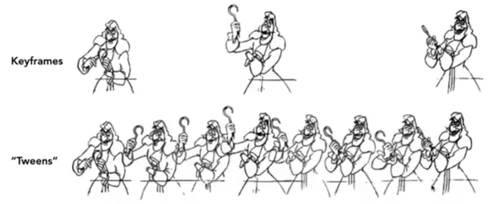
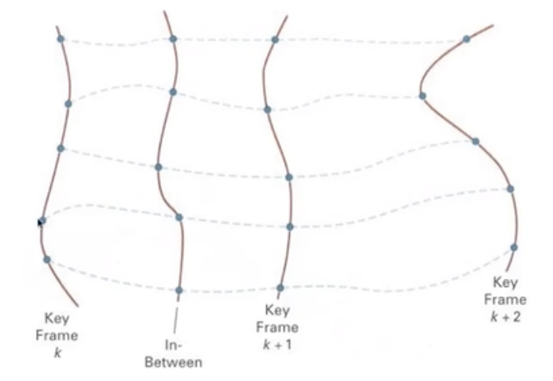
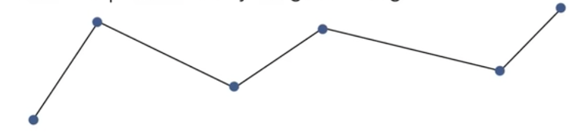
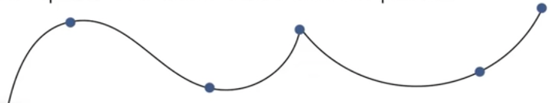

# 动画（Animation)

## 关键帧动画（Keyframe Animation)

基于关键帧进行插值形成一个动画。

一般是动画师（比如首席动画师）创建关键帧（keyframes）。

然后助手（人或者电脑）来把两个关键帧之间的动画给“补齐”。

我们可以把每一个帧当作是一个带有参数值的向量，这样我们就可以通过插值的办法，“补齐”中间缺失的帧。

线性插值通常并不够好

我们经常希望有更加顺滑，或者更加可控的非线性插值， 例如 splines。

## 物理模拟动画

现代动画更加倾向于基于物理模拟而产生的动画，这里我们会在物理里单独讲解