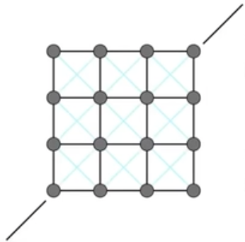

# 物理模拟（Physical Simulation)

### 牛顿定律

$$
F=ma
$$

通常基于牛顿定律进行计算，我们只要模拟出物体的 受力情况，加速度，即可计算模拟。

###  基本物理动画原理

$$
x_{t+\Delta t} = x_t + \Delta t v_t + \frac{1}{2}(\Delta t)^2a_t
$$
只要正确建立物理仿真，就可以确定每个时刻的位置。

### 流体（Fluids）

## 弹簧系统

### 质点弹簧系统（Mass Spring Mesh）

比较常见的一个系统， 可以用来模拟头发、布料等

一般是多个质点，由多个弹簧连接的系统

#### 理想弹簧

我们这里首先约定弹簧系统是处于理想情况。

下面是弹簧的一个最基本的单元，这里会有 a 、b 两个质点，由一个长度为0的弹簧进行连接。

$$
f_{a \rightarrow b} = k_s(b-a)\\
f_{b \rightarrow a} = -f_{a \rightarrow b}\\
$$
其中 Ks 是劲度系数: stiffness。

a，b 是一个矢量

第二个公式是满足胡克定律（Hooke's Law)

#### 非零长度弹簧

但是正常的弹簧还需要有一个默认的长度（rest length), 所以真实情况下， 非零长度的弹簧需要对上面公式做一些调整：
$$
f_{a \rightarrow b} = k_s \frac{b-a}{\parallel b-a \parallel }(\parallel b-a \parallel - l )
$$
其中 l 就是指弹簧默认长度

#### 考虑能量损失

recall:  在物理中，一般符号上方打一点，表示一阶导数； 两个点，表示二阶导数， 如果x是弹簧上的一个交点的向量，那么我们有：
$$
x\\
\dot{x}= v\\
\ddot{x}= a
$$

##### 简单的阻滞移动（motion damping)

- 表现上就像在运动中有一个力阻滞拖动（viscous drag）
- 减缓移动方向的速度
- Kd是表示阻滞系数（damping coefficient）

缺陷：

- 会拖慢所有点的移动，会导致所有的运动都停下来
- 这个只能描述外部的力，但是无法描述弹簧之间内部的力

##### 内部弹簧阻滞（Internal Damping for Spring）

我们可以考虑应用在b上内部阻力

- 认为阻滞拖动只会在弹簧长度改变时候发生
- 弹簧系统的成组的移动不应该被减缓
- 这只是一种特定类型的阻滞

#### 弹簧结构

弹簧系统的表现，是由弹簧系统的构成结构来决定的。比如：

- 这种结构不可能抵抗切变(shearing)
- 这种结构不能抵抗 “立面化”（out-of-plane bending）

- 这种结构不可能抵抗切变(shearing), 但是可以有 各向异性偏向（anisotropic bias，即图示方向虽然能让其抵抗切变，但是另外的两个角仍然不能抵抗切变）
- 这种结构也不能抵抗 “立面化”（out-of-plane bending）

- 这种结构可以抵抗切变(shearing),  只在很少的方向上有各向异性偏向
- 这种结构也不能抵抗 “立面化”（out-of-plane bending）

- 这种结构可以抵抗切变(shearing),  只在很少的方向上有各向异性偏向
- 这种结构也能抵抗 “立面化”（out-of-plane bending），并且红色的弹簧应该相对弱一些
- 这种结构就可以大概模拟一些布料的情况， 但是与真实的布料还是有差距的（真实的布料纤维连接存在编织的情况）

### 有限元方法（Finite Element Method， FEM）

替代弹簧系统的一种方法，被广泛的用于汽车碰撞模拟

主要考虑到力的传导和扩散

## 粒子系统（Particle Systems）

建立大量粒子的动态模型系统。

每个粒子的运动是由一组物理（或非物理）力定义的。

在图形学和游戏中流行的技术

- 容易理解和实现
- 容易扩展： 少量粒子用于速度，更多用于更复杂情况

挑战

- 粒子可能数量较大（比如流体）
- 可能需要加速架构（如根据相互作用找到最近的粒子）

#### 最简单的粒子算法：

- 根据需要创建粒子
- 计算每个粒子的受力情况
- 更新每个粒子的速度和位置
- 根据需要删除粒子
- 渲染粒子

#### 粒子之间可能的力：

引力(Attraction)和斥力(repulsion forces)：

- 重力(gravity)，电磁力(electromagnetism)...
- 弹力(springs)、推力(propulsion)...

阻力(Damping forces)：

- 摩擦力(Friction)，空气阻力(Air Drag)，粘稠力(viscosity)...

碰撞：

- 墙、容器、其他物体...
- 动态物体、身体部分...

#### 粒子系统可以描述的东西

液体动画

烟雾

鸟群移动算法

分子结构、运动

Rock

